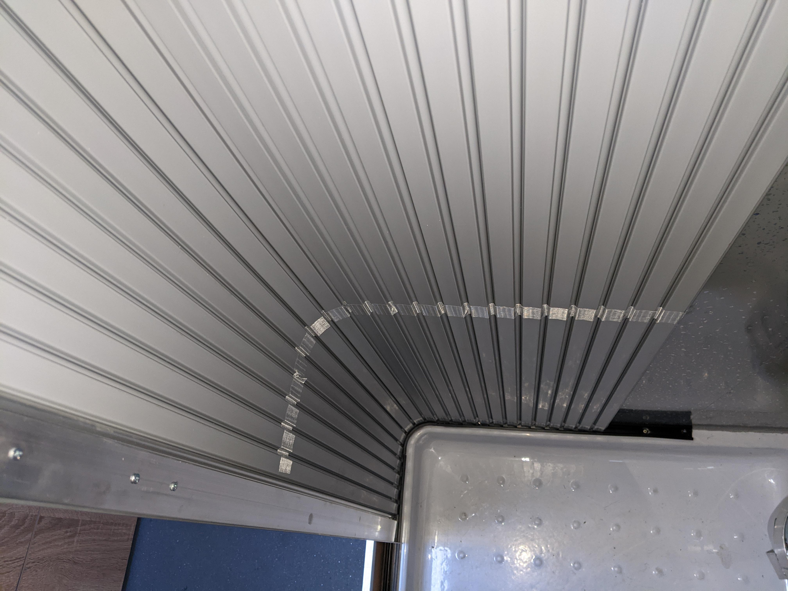
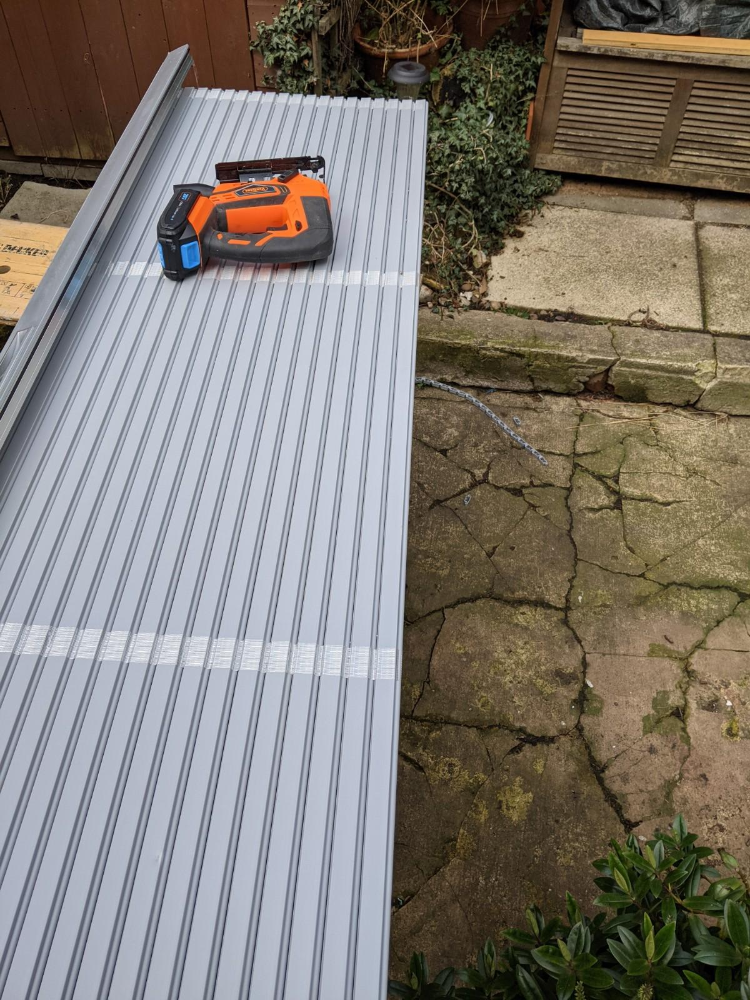
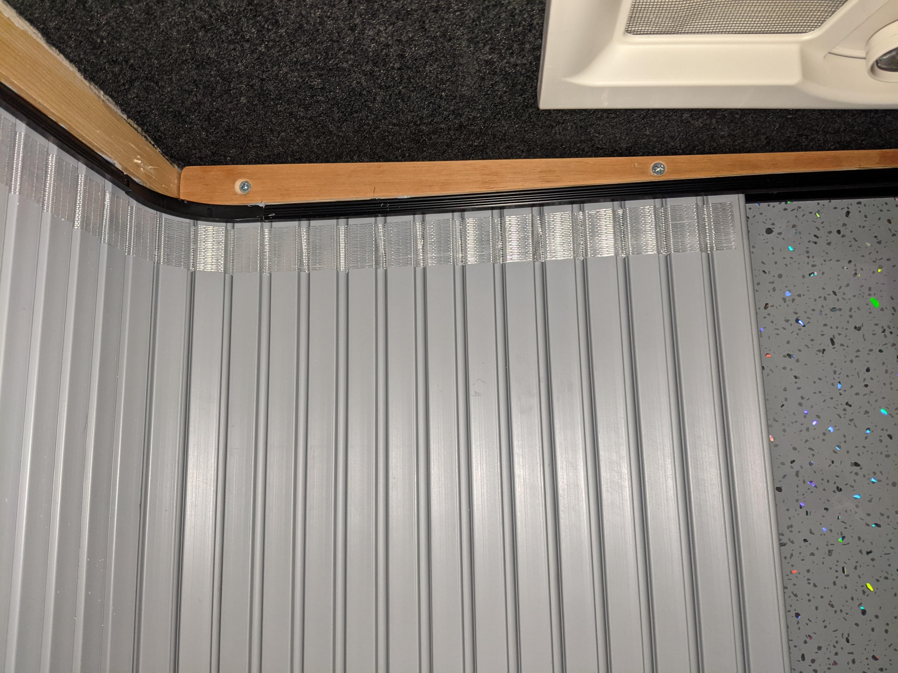
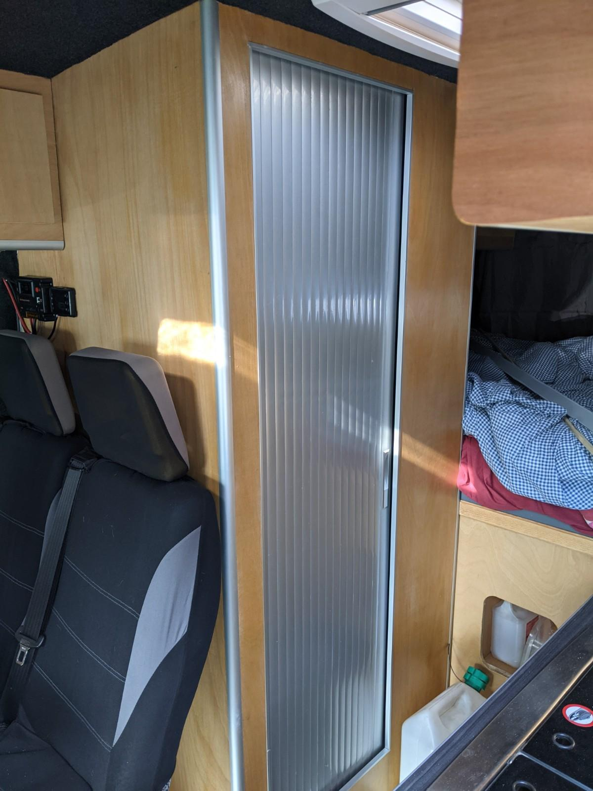

It's hard to keep any secrets in a campervan but nonetheless a bathroom door is essential.

The original fag-packet plan was to install a tambour door; an upmarket version of a concertina door, made of thin interlocking vertical strips which move along runners. The strips are hinged so the door and runners can curve around corners, this helps save space as the door tracks around the inside wall of the cubicle. 

Our previous van had a good old-fashioned can't-get-to-the-toilet-because-there's-a-dog-in-the-way hinged door, so this build needed to avoid the same issue, especially as the van is narrower.

Given the slightly ad-hoc nature of building the shower cubicle, there was a lot of decision deferral and optimism about how the door would fit. After kitting out the shower room I had a measure up of the hole I needed to fill.

I bought the door kit from [Tamdour](https://www.tamdour.co.uk) who offer custom sized kits and a range of finishing colours and fittings. There was a bit of delay as is to be expected given the global plague and national import/export troubles but the price, quality and the customer service was great.

Any professional will tell you that measuring once, with a healing collarbone, in the dark, is the textbook way to get precise measurements so when the door kit arrived it needed a bit of shortening with a jigsaw.

Now the it was time to pay off my decision-making deferral debt, my main concern was whether I could get the runners parallel as this would greatly affect the smoothness of the door 'action'.

Given the wonk factor of the shower cubicle I was 56&percnt; optimistic that this could be easily achieved, bearing in mind that the ceiling is higher in the middle of the van and lower toward the walls. This meant that the top runner, which would bend around 90&deg; inside the cubicle would need to stay parallel to the bottom runner despite the ceiling height variation.

This time I measured things more competently in order to get the same distance between runners. It was clear I needed a bit of tapered support to fix the top runner to. The runners are plastic so they don't have any real strength, you have to countersink small screws into the bottom of the runner to fix them. I also applied a liberal amount of Stixall to help them stick consistently along the entire length.

A quick and nervous tolerance check and I was 87&percnt; confident the runners were set up correctly.

Next I fed the door into the runner, in a small space like this it's convenient that the door can roll up into a thinnish spiral. It went in very smoothly so all that was left to do was put some stoppers in the runners to keep the door from escaping again. A finishing strip was added to the inside of the door frame to tidy up the finish.

I'm pretty pleased with the results, the door doesn't rattle when driving and the open and close action is smooth, it has allowed me to make the most of a smallish shower enclosure and the silver finish looks good with the other van fittings.
