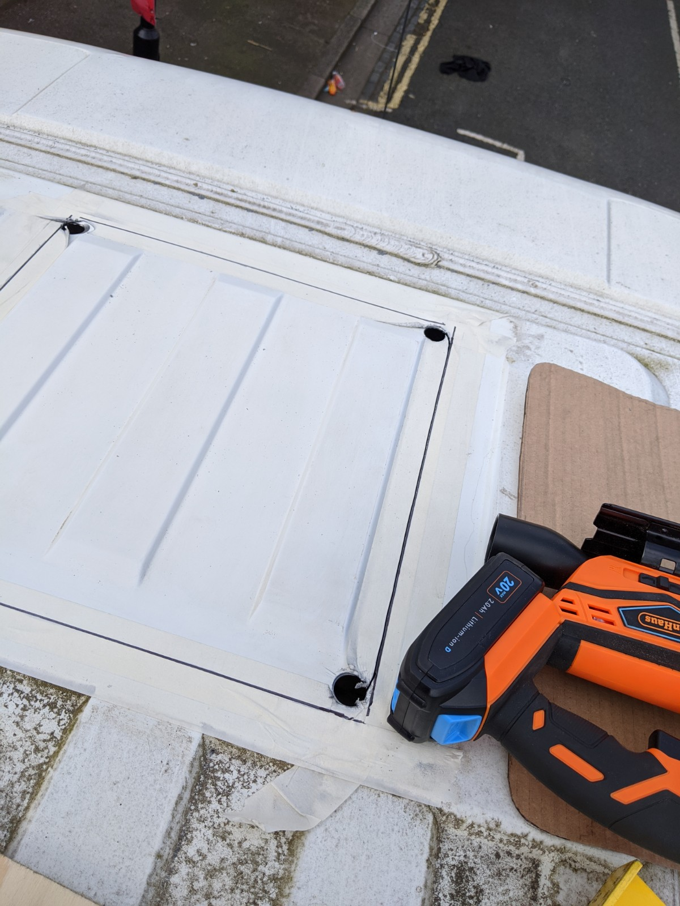
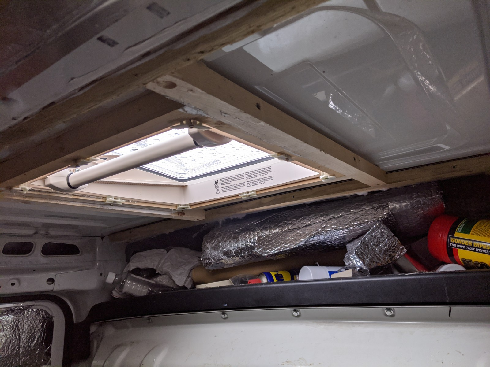

With the floor 'mostly-installed' (this becomes a very common phrase), I ordered some skylights and started thinking about where I wanted them and how frightening it was to cut big holes in the roof.

As mentioned these vans are pretty lightweight, mostly due to their coke-can thin bodywork. I probably could have used a tin opener but decided I needed a cordless jigsaw for the job. I can't park near enough to a power socket and I wanted new toys to play with. £70 gets you a 'Von Haus' jigsaw, it looks like something Fisher Price would sell but it can rip through 1.5mm steel in a vaguely straight line just fine.

The first sky light was going on a nice flat panel just above what I hoped to be the dining area, no corrugated metal, fairly simple. I had to remove a twirly roof vent first.

Measuring things up and then measuring again, I made a cardboard template to reduce the margin for error. I cleaned the outside of the roof, marked out my template with a Sharpie and sweated a bit, and did some more measuring.

Then with a 22mm hole cuttting bit I drilled just inside the corners of the marked out lines.

Then it was 'Haus Party' time, a deafening 10 minutes of cutting the square for the first skylight.
A test fit showed things had gone OK, a bit of manual filing and a touch up on the bare cut metal with Hammerite and I was starting to think it might all be fine.
A light sand on the metal where the sealant would go, makes a good key, similarly the sky light plastic frame which sits on the sealant got a good scuff up.

The type of sealant here is important, it has to withstand highish temperatures as it will be in direct sunlight, maybe in the South of France if I'm lucky and it also needs to retain flexibility. I went with Everbuild Puraflex 40, as it had all the characteristics I needed and was available from Toolstation. Having materials like this at hand and just around the corner is pretty essential.

I was just putting a juicy bead of sealant on the skylight frame when the rain came down, thankfully the seal was good and no leaks, lesson learned, check the weather as well as your measurements.

#### TIL:

- Check the weather and start early, being scared takes time.
- Make the frame for the skylight before cutting anything.
- Masking tape really sticks hard when it has been heated up with a hot jigsaw blade.
- Angle grinders are better than jigsaws for this.
