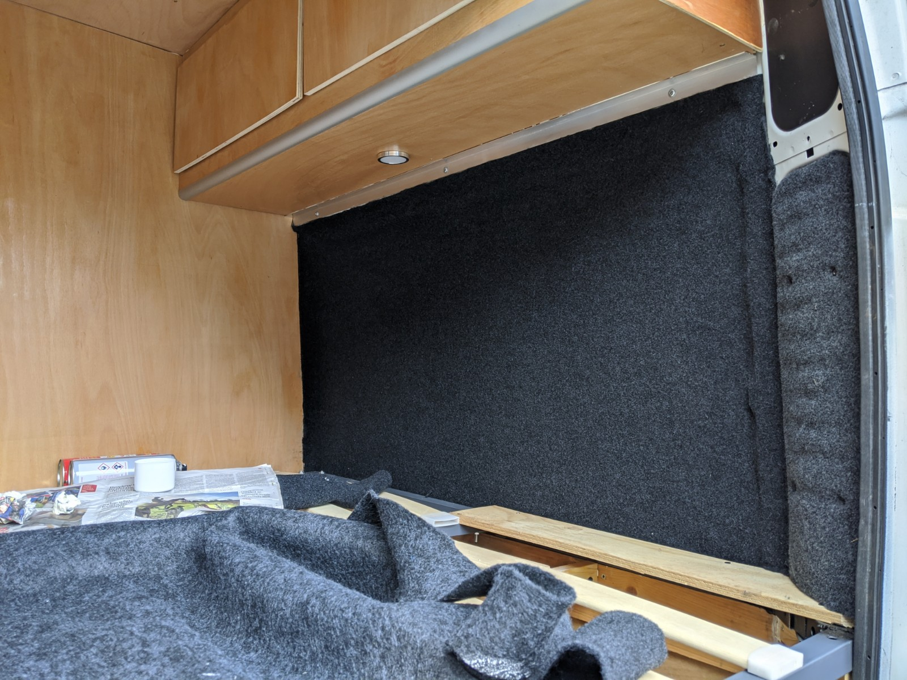
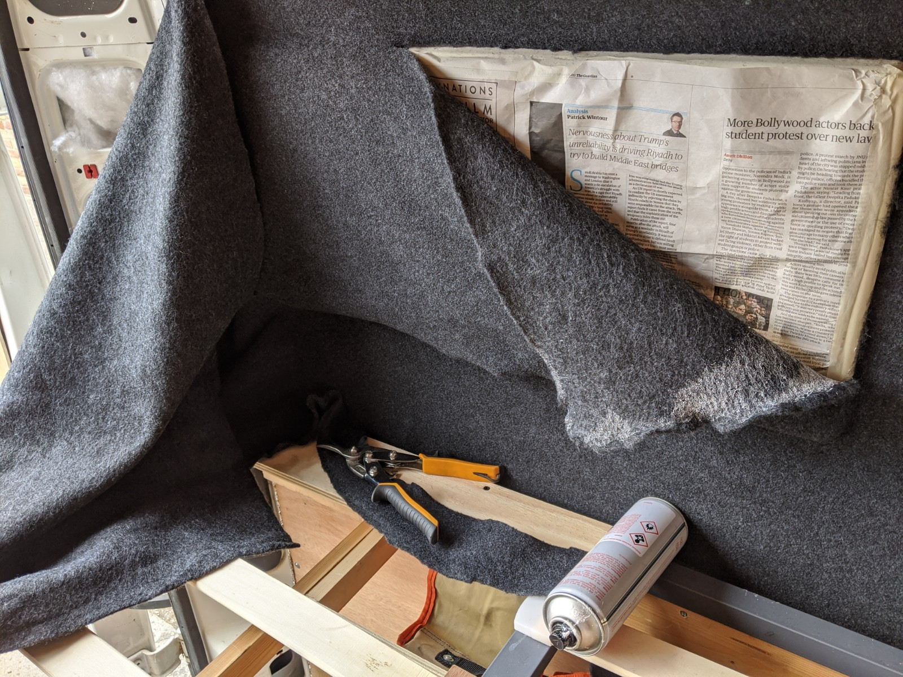
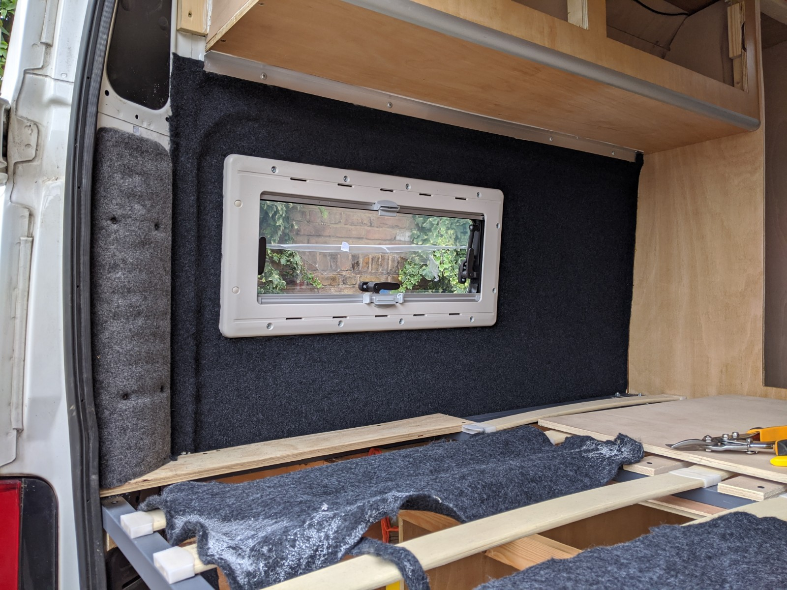
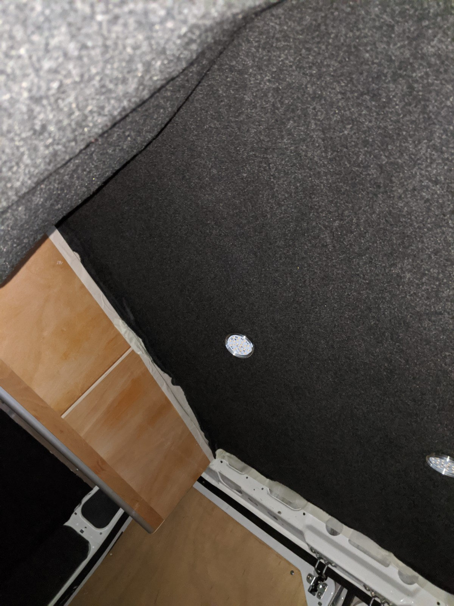
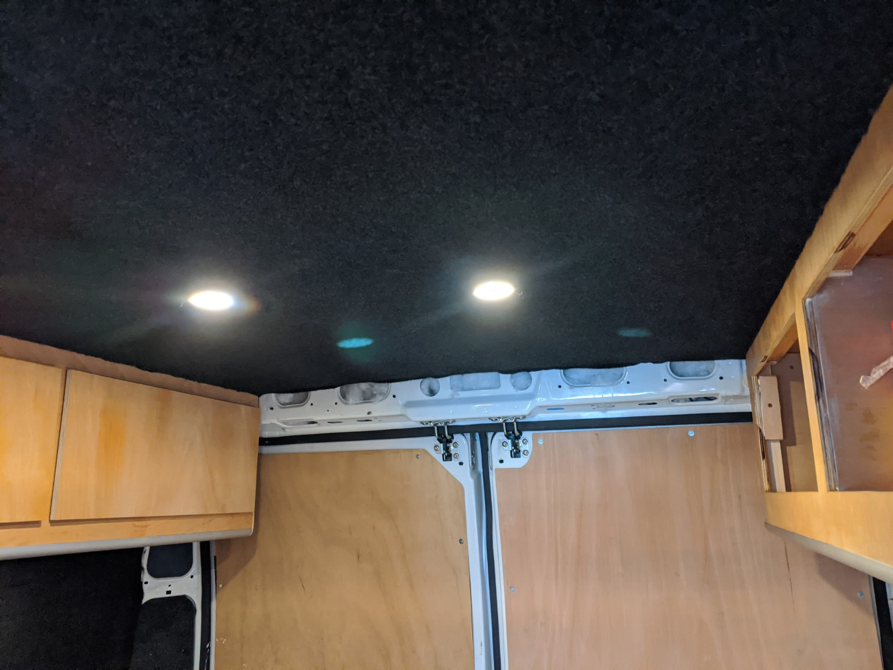

My get out of jail card for all the shonky ply lining in the van was that I'd cover it in stretchy van lining carpet.
Not only does this help with insulation and sound proofing, it is stretchy enough to cover all those awkward corners and shapes that would have been a major hassle to do elegantly with wood.

Many van builders use tongue and groove pine to finish the van, this is marginally lighter than ply and carpet but it's also a lot of work to get right.

I'd lined the back of a Mercedes Vito a couple of years back and I knew this was within my skill set so I bought a big bag of stretch carpet and spray adhesive, approx £80. for 20m&sup2; and 10 cans of lining adhesive.

The first part of the van to get lined was the rear, I had most of the work in the bedroom area finished, but before I put the new mattress in, I had to line the walls and ceiling.

I measured up the 'easiest' wall and cut an oversized piece of carpet, 20m&sup2; is quite unwieldy so I did this in the house.

The most important tools for the job are masking tape and a sharp craft knife with break off blades. The carpet really dulls anything you cut it with so you get through a lot of knife.

The difficult bits would be neatly trimming around the window and bringing the LED lights 'through' the carpet without visible cutting. I mask
I started by masking off the adjoining surfaces of any surfaces I'd be lining up to eg. the window frame and cabinets. The spray glue is quite easy to make a mess with so this helped with the overspray and stops the carpet sticking to all the things it shouldn't stick to. You can remove the adhesive easily with meths or alcohol but this saves a lot of cleaning up.

The benefits of working with this stuff is it's very forgiving, you can stretch it by hand, join patches of it together pretty seamlessly and peel it off if it goes a bit wrong.

The finish is professional despite being fitted by a complete numpty. It was a very humid and rainy day when I did the lining so I had to leave the doors shut, this was a mistake. It got very sweaty in the van quite quickly, it was like a glue addict's sauna by the time I'd finished, I'd started the job with a significant hangover and the effects of spray adhesive and dehydration didn't improve matters.

The ceiling LEDs were not too bad to work with, it's a shame they couldn't just be unplugged and removed but in the end all I had to do was unscrew them from the ceiling ply, work right up to them with the carpet and adhesive, then cut a minimal cross-slit in the carpet where they would sit. The just pull them through the slit in the carpet and spray glue and carefully position the cut carpet against the ceiling ply. Even if the cross cuts were visible, the light sits on top of them and hides them well.

There's a ton more lining to do but this unlocks putting the mattress in the van and having a proper bed, I can work forwards now and do the rest of the ceiling. It made sense to do it in sections. I think trying to line the entire ceiling with one piece of carpet would be very hard work.

I wonder if it would have made more sense to line the van at the point I ply-lined the ceiling. My only concern was that I'd make a mess of the carpet fitting all the other things like cupboards, also it was handy to be able to see where the structural screw-in points were.
