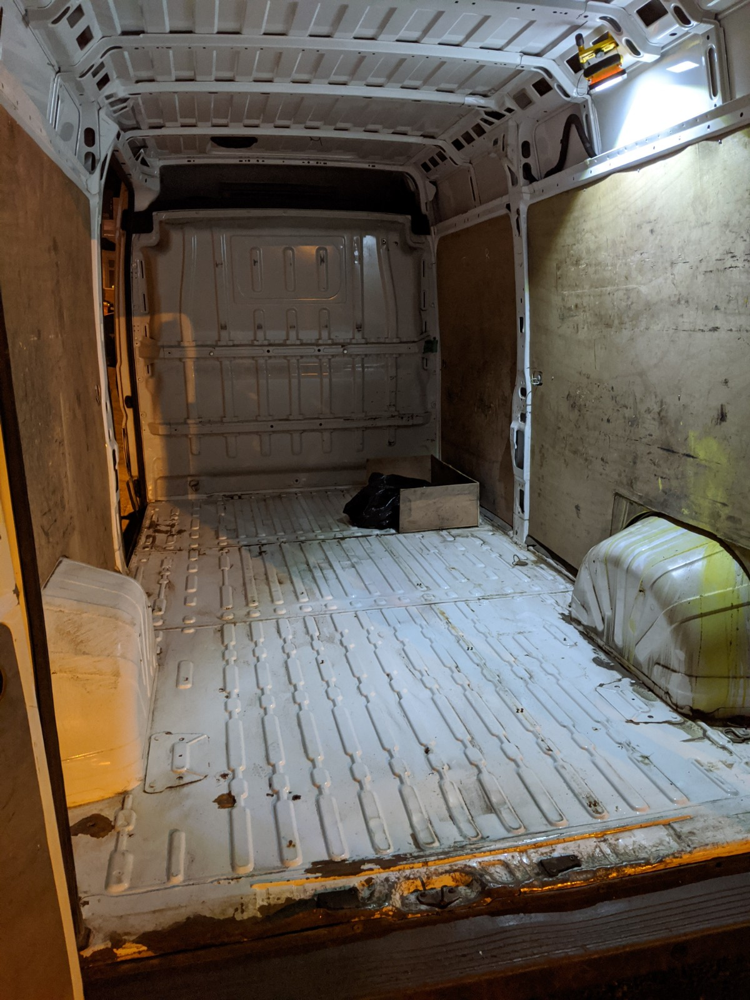
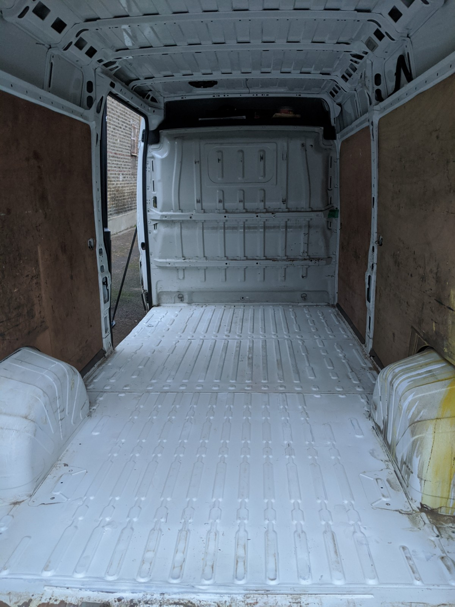
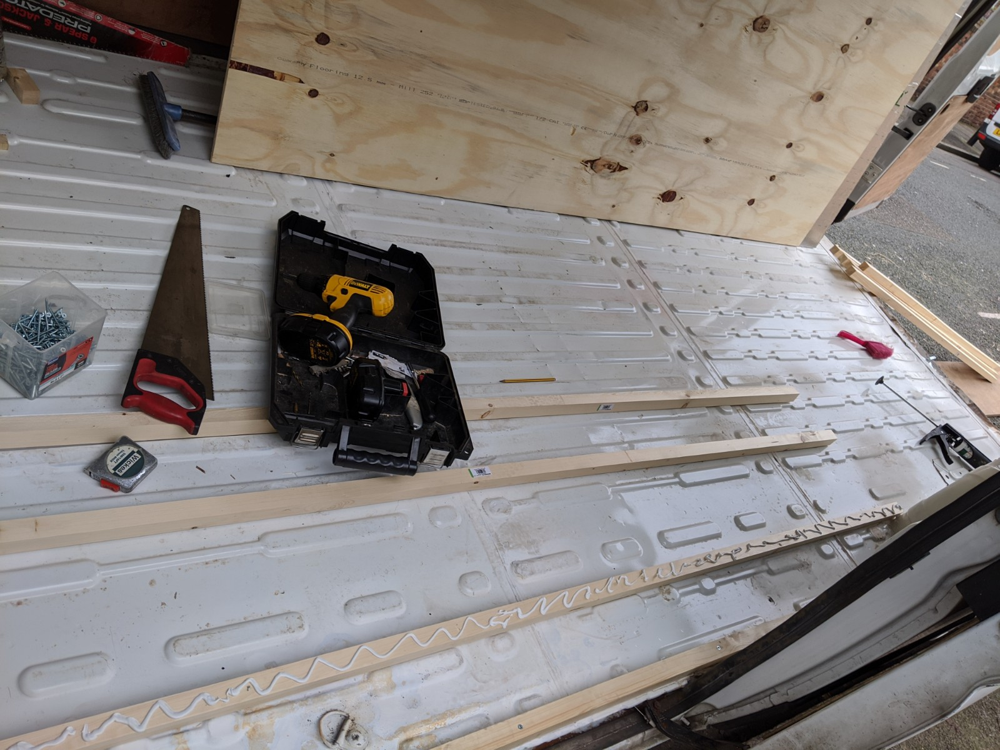
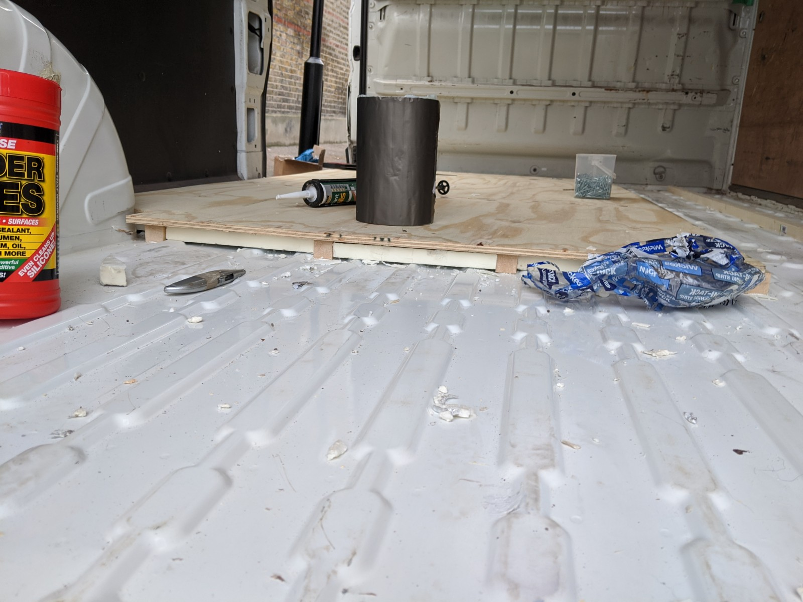

After emptying the van, donating the heavy duty racking to the local scrap collectors and ripping out the smelly floor I could see what I was working with.
The van was used predominantly in Scotland so there was a lot of rust spots on floor where the flooring screws had gone through the metal cargo bed.
The rear of the van was a bit of a state, something heavy had been dropped in the back, possibly a diesel engine as it had that kind of odour about it.

I began to deal with this by filling larger holes with car body filler and smaller fixing holes with adhesive sealant.
Hammerite straight-to-metal paint finished up the bare and rusty metal.

With nearly a blank canvas I had the chance to plan out what the first steps of the build should be. This can be quite confusing as the order you can do things needs a bit of thought. For example it's easier to insulate the roof once the frames for the skylights are fitted, not impossible to do in reverse but probably more time consuming.
I decided to start with the floor as it needed a layer of insulation and layer of ply. Simple enough.

Starting with batons which were roughly the same thickness as the 25mm Kingspan insulation, I used grab adhesive and screws to fix to the van cargo bed.
I placed more batons by the sliding door as I guessed this is where the most footfall would be so better support here. The far (driver's) side would have a raised floor so I didn't baton across the van entirely.

