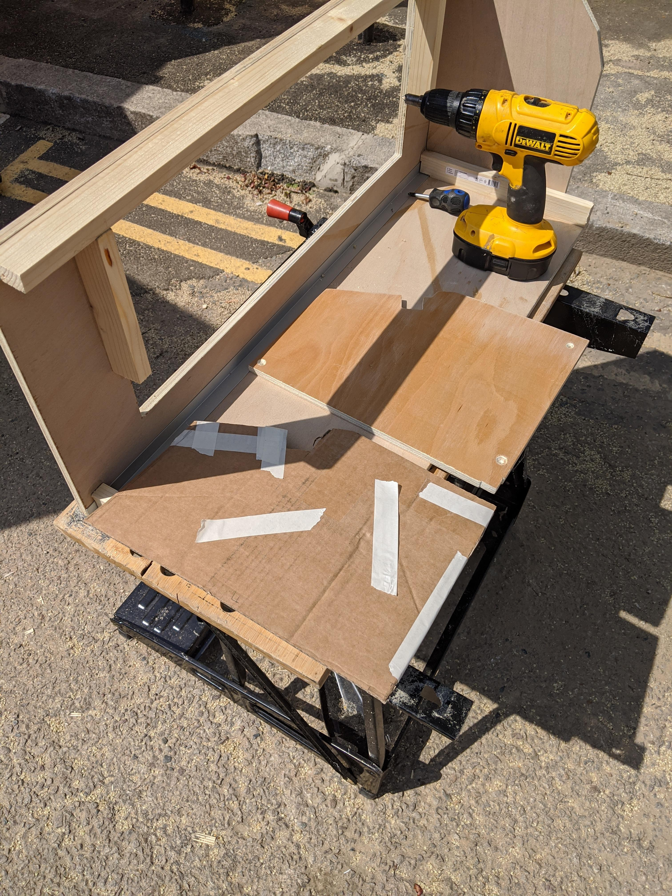
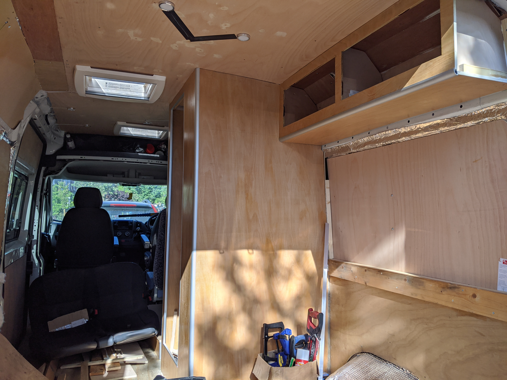
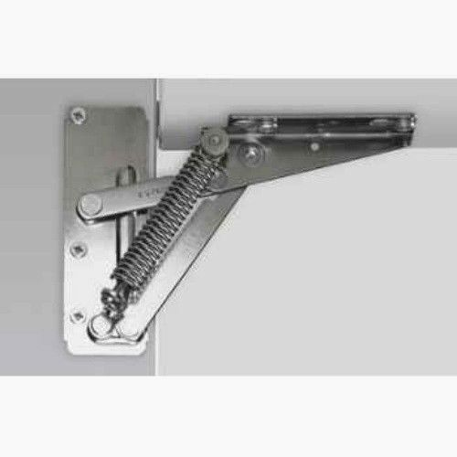
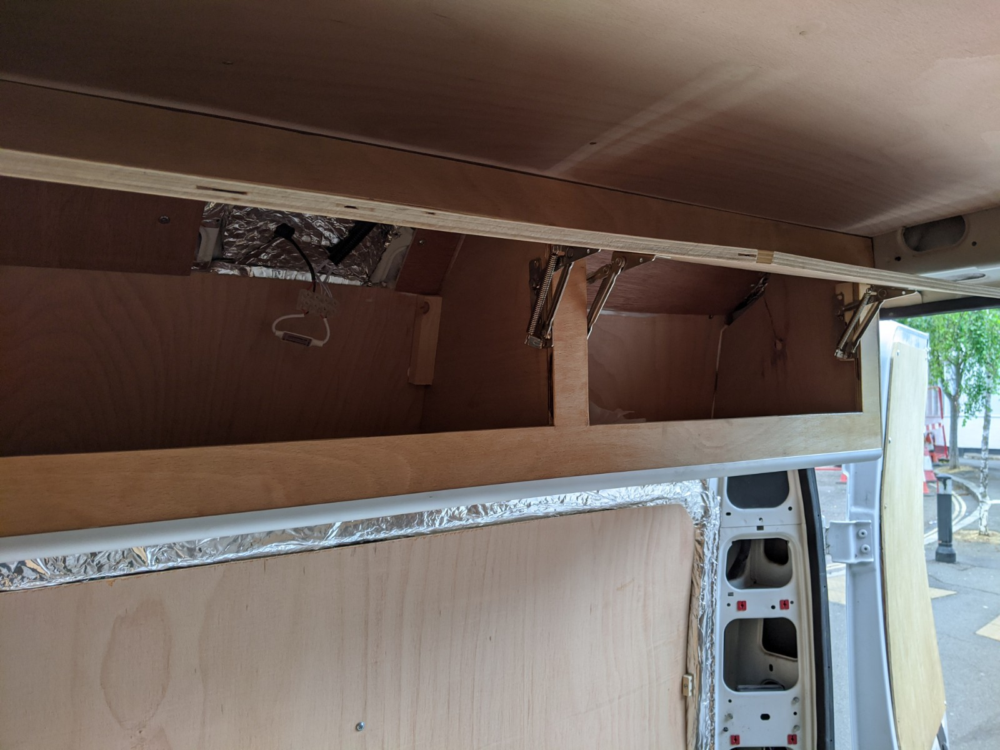
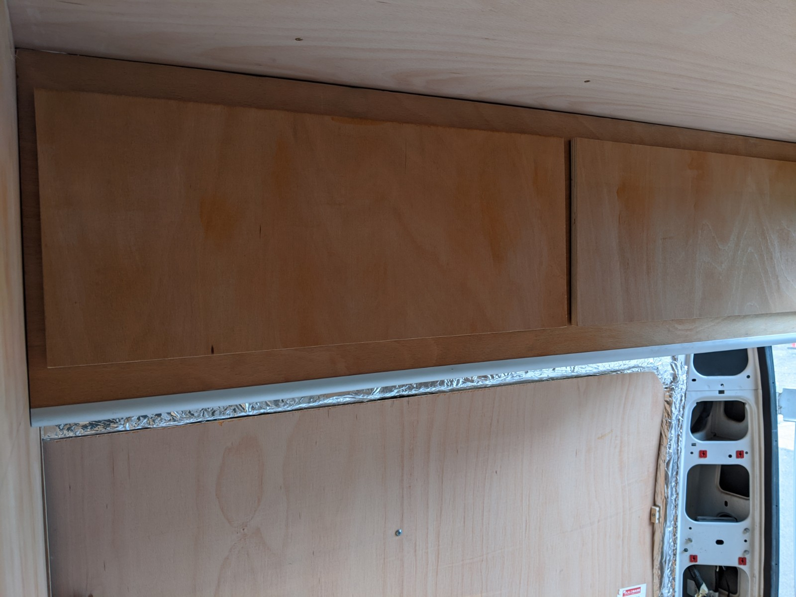

Our motley crew of dogs are a lovely bunch, but they are dogs and they will steal our food, make beds out of our clothes, shed hair on anything they see, and occasionally chew stuff up.

The bit of the van build I was really dreading was building overhead storage but it's a must for separating things you care about from things you need.
I'm really not cut out for woodworking, it requires a reserve of patience and know-how I just don't have. I can put shelves up and I like sanding things and lockdown was putting paid to ordering cupboards ready made from the internet. I'd calculated that even if I could pay a skilled person to make them I'd need to spend £800.

Bouyed by the experiment in building the crapper cubicle, I was now sold on joining things together with aluminium Multipanel corner extrusions. Even crappy ply has some charm once you sand and varnish it, and covering those awkward corners with brushed aluminium was the answer to all my woodworking woes.

A few fag-packet sketches and some YouTubes later and I decided I needed an L section to join to the roof and sidewall of the van and some scribed end panels.

I'd found some self-supporting hinges on eBay which would take the weight of a 12mm ply door, and I decided the least-labour-intensive-yet-practical configuration was two doors per unit.

Fixing to the toilet cubicle was a win-win situation, now I had the cupboard secured by the toilet wall and vice-versa, magic.

Next up was storage above the space where the bed will be, at some point I'll be able to fall asleep with the mild anxiety of being hit in the face with a cabinet.

Getting the finish right for the cupboard doors felt like a woodworking task above my pay-grade. I still had a van awash with bits of 12mm ply so I thought I'd make some prototype doors from some of this and see how hard it was.
I found some really great sprung self-supporting overhead storage hinges on eBay, they can take the weight of the cupboard door and have a stay-closed cantilever to them so I probably won't need to fit catches. We'll see if that theory holds up once the cupboards are full and I turn a corner quickly.

Getting the cupboard doors lined up and the hinges clearing the woodwork just right was a bit of trial and error. I can't really claim to have found a method of doing this yet. It was a bit of guesswork and moving things about slightly until I had two doors looking similar. They still need a sand and a varnish but for a first attempt I'm happy, I've achieved the level of utility I need, I can probably make the doors look better with an edge band and a handle.

The challenges in doing this are finding a level. The van walls are not vertical, the van is not parked on a perfectly flat piece of tarmac. One thing I've learned in this build is not to try and achieve perfection, structural integrity is the goal. I want a van we can go on holiday in, hopefully the holiday won't involve obsessing about not-quite-plumb-or-level-woodwork.

