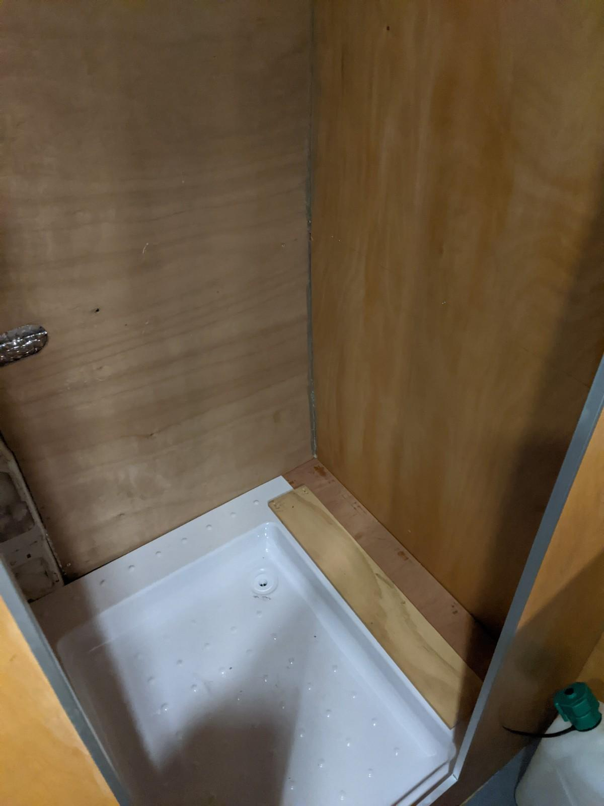
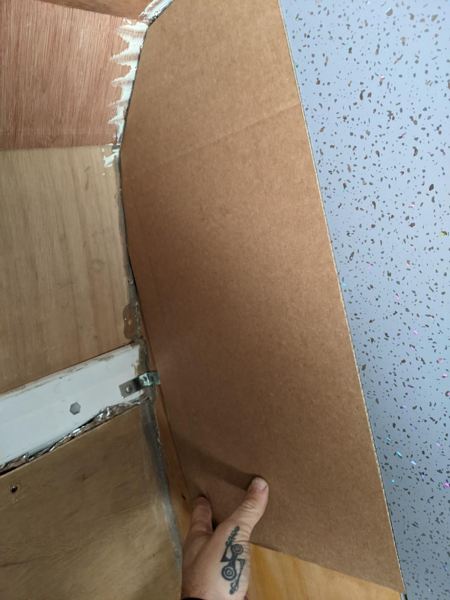
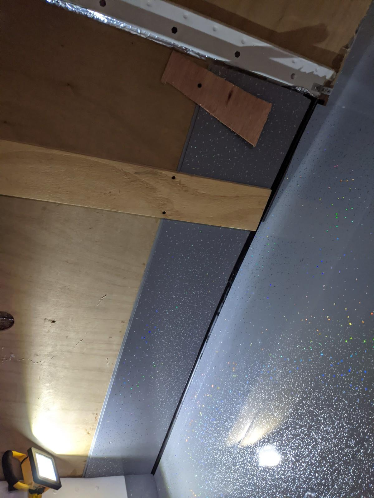
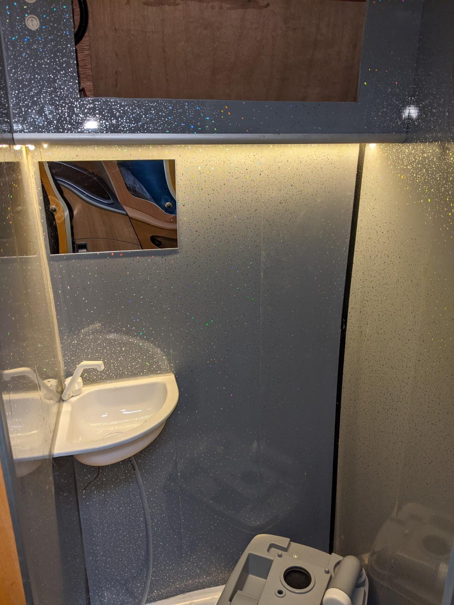
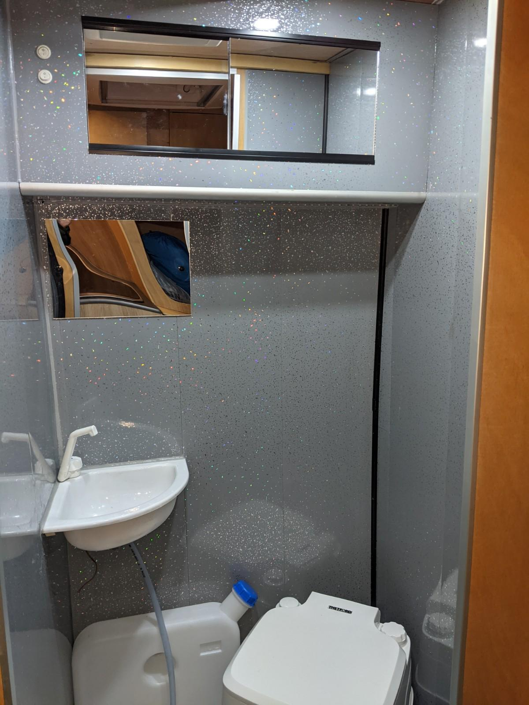

Part 2 of Kiosk du Merde.

I'd had the time to research a bit on how to make a wet room, I was trying to find reasonably priced lightweight materials which would allow me to use the bathroom as a shower room. You can spend a lot of money building a campervan bathroom, cassette toilets with external access hatches and bespoke shower trays being at the pricey end of things.

I knew from the previous van that a cheaper toilet works fine, I prefer the shovel to the pan, most of the time it's used for a midnight pee, no need to go for the nuclear option. 

I was keen to be able to shower in the van, mountain biking being a messy business, I'll usually go for a campsite shower but again it's nice to have an option if you're parked up somewhere more remote.

Water heaters are great, history suggests that for the price, space and complexity they aren't worth it. I've opted for a provide-your-own-hot-water system, a couple of kettles worth in a water butt will do. It's not gonna be a regular occurance.
This still meant the shower room should be waterproof, even a strip wash can get a bit drippy so I bought a pretty cheap shower tray. A lesson learned here is to research which tray you'll go for and make a room with the dimensions that suit this. I didn't do that, so I had to improvise in places.

Lining the walls was another thing that required some thinking. You can get tank liner kits, a sort of tape and rubberising-paint combo which looks fairly simple, some people just use waterproof wallpaper and good adhesive. In the end I went for tongue and groove PVC interior cladding. I've mixed feelings about the stuff, it's pretty fragile until it's stuck to something, it is lightweight and cheap and provides a bit of an airgap style of insulation. It won me over as I could imagine it being easier to scribe into the very uneven shape of the shower cubicle.

It was pretty simple to get the larger pieces in, a decent amount of Stixall to keep the panels in place and I had 2 walls done quite quickly.

Another lesson learned with this job was mentally simplifying cladding a really wonky and bendy van wall, the plywood walls were simple but the curved wall of the van was a pig. I decided on a bit of eye-level storage, more as a way to avoid having to try and work up to the roof of the van.

This questionable design meant I could use up more of the leftover cladding, and the leftover aluminium extrusion. I found by doubling up the cladding I could make a panel that was slightly more robust and fitted the aluminium channel.

A couple of things are left to do regarding plumbing, I need to make fixings for the water container below the sink and plumb the sink waste.

I've decided a separate container for water is easier for now. I can fill this when I need to and add hot water when I need a shower. The problem we continually had with a fixed shared water tank was we'd forget to fill it when arriving somewhere. Driving around with a full tank is an option but it's also another thing to remember. I like the simplicity of filling them on site or wherever when I need to.

There's also a tambour door to fit to finish up the room. The kits for these aren't that cheap so a shower curtain might be employed in the mean time.
