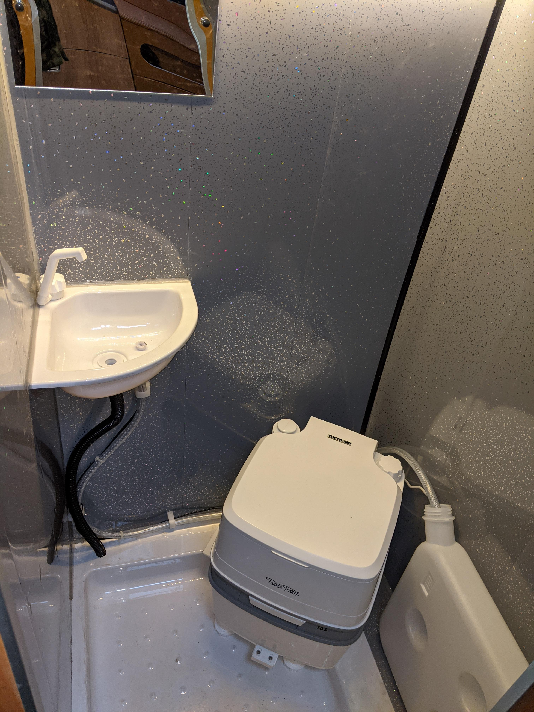

Part 2 of Kiosk du Merde.

I'd now spent some time researching how to make a wet room, I wanted reasonably priced, lightweight materials which would allow me to use the bathroom as a shower room.

I knew from the previous van that a cheaper toilet works fine, I prefer the shovel to the pan, most of the time it's used for a midnight pee. So I decided against a cassette toilet as the external access would be hard work in terms of positioning, cutting bodywork etc. I could have made a hatch into the bootspace but also the price difference of the cassette units compared to a 2 piece portapotti is a few hundred quid, I'd rather spend that on a decent quality tambour door.

I was keen to be able to shower in the van, mountain biking being a messy business, I'll usually go for a campsite shower but again it's nice to have an option if you're parked up somewhere more remote.

Water heaters are another expense in this area, they are great, but history suggests that for the price, space and complexity they aren't worth it. I've opted for a provide-your-own-hot-water system, a couple of kettles worth in a water butt will do.
I still wanted the toilet/shower room to be waterproof and easy to clean, even a strip wash can get a bit drippy so I bought a pretty cheap shower tray. A lesson learned here is to research which tray you'll go for and make a room with the dimensions that suit this. I didn't do that, so I had to improvise in places.

Lining the walls was another thing that required some thinking. You can get tank liner kits, a sort of tape and rubberising-paint combo which looks fairly simple, some people just use waterproof wallpaper and good adhesive. In the end I went for tongue and groove PVC interior cladding. I've mixed feelings about the stuff, it's pretty fragile until it's stuck to something, it is lightweight and cheap and provides a bit of an airgap style of insulation. It won me over as I could imagine it being easier to scribe into the very uneven shape of the shower cubicle.

It was pretty simple to get the larger pieces in, a decent amount of Stixall to keep the panels in place and I had 2 walls done quite quickly.

Another lesson learned with this job was mentally simplifying cladding a really wonky and bendy van wall, the plywood walls were simple but the curved wall of the van was a pig. I decided on a bit of eye-level storage, more as a way to avoid having to try and work up to the roof of the van.

This questionable design meant I could use up more of the leftover cladding, and the leftover aluminium extrusion. I found by doubling up the cladding I could make a panel that was slightly more robust and fitted the aluminium channel.

The plumbing is simple, a removeable water container which bolts to the wall, immersable pump and microswitch tap. I definitely didn't do things in the most logical order (like planning where the waste pipes would leave the van) but it's in now and fairly neat and tidy.

Apart from the bad planning, the worst parts of this job involve bathroom sealant. Despite my love of the problem-solving Stixall Adhesive, making bathroom sealant look presentable is beyond me, it's like trying to wipe your arse with a plastic bag. I've yet to run a presentable bead of sealant between the walls and shower tray. I'll have a tiday up and do it when the weather is warmer.

After that it's fitting the tambour door.
