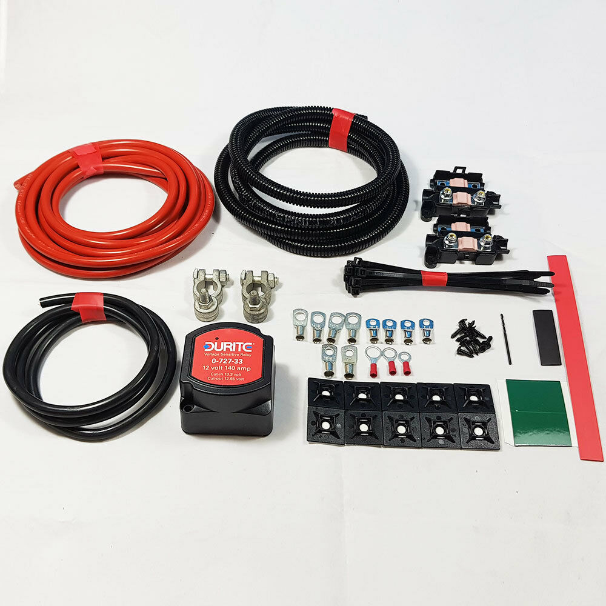

Think about wiring early on in the build, this was the advice I got from all those YouTubes. I had a mental picture of the layout and where appliances would go but the devil is in the detail and I'd boarded most of the van and floor without fully understanding where all the wires would go.

I used a flexible plastic trunking to provide a way to wire in ceiling lights, similarly I had remembered to run some under the floor to where the kitchen sink and fridge would be. I had run string through the trunking to allow me to pull the wires through, this felt like good forward planning and certainly made life easy when it came to running wires through the van, it probably would have been simpler to start with trunking full of wires but getting supplies in a global pandemic was hit and miss.

My mental map of the wiring was to run a relay circuit from the starter battery, located in the cab, to a leisure battery _somewhere_ in the van.
The leisure battery would fit under the front passenger seat but this would be tight and would mean a lot of wiring from the leisure battery onwards. It would also fit under the rear passenger seats and on the van bed floor, almost completely submerged below the false floor. This was the option I went for, it put the leisure battery nearer all the things it would service, nearer the solar panel, and the distance from the starter battery was fine.

The split charge relay kit from eBay was simple to install. The feed from the starter battery goes via a switching relay to the leisure battery. The relay switches 'on' when 13.3V is detected from the starter battery (typically when the alternator is generating additional power) and this charges the leisure battery. This type of switching circuit ensures you never draw power from the starter battery to the point where the vehicle won't start.

I installed the relay as close as possible to the leisure battery in a plywood box built into the rear seat frame, this would all be below the dining area floor and strapped to the frame which seems like a safe-yet-accessible place. I heat-shielded the battery box from the hot air heater with some aluminium sheet and silver insulation tape.

Next in line was a fuse box coming from the leisure battery. This allows a single feed to branch out into different circuits for lights, 12v sockets, USB points and the power hungry fridge and sink circuit. A step up from the twist-and-tape sort of wiring I'd done before.

The solar panel is wired in via a charge controller which doubles as a battery-o-meter, [read more about that here](/blog/fun-in-the-sun/).

With some additional panelling around the passenger seat and a cover for the battery it's all fairly tidy for now.

Note the use of off-cut Multipanel shower corner extrusion for the seat box, is there a problem that _can't_ be solved with this stuff?
