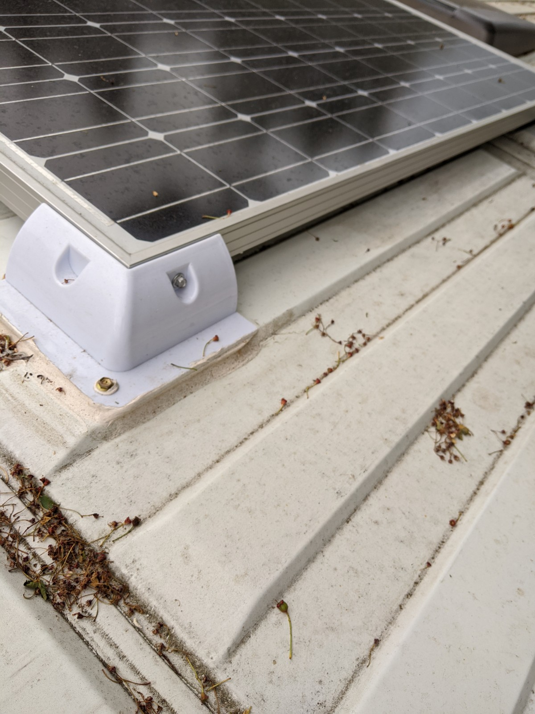
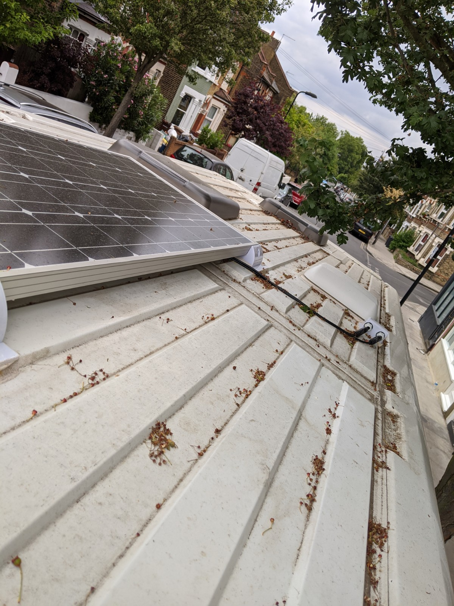
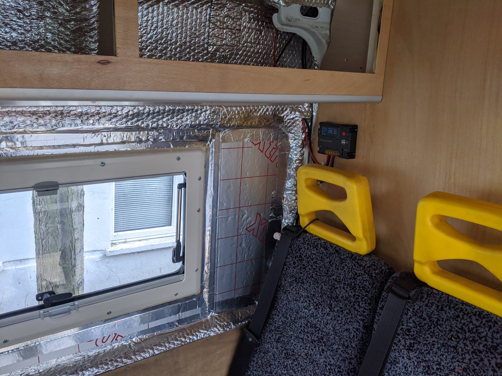

A large expanse of van roof was perfect for a solar panel. Solar charging technology is pretty simple, cheap and readily available.
I opted for a 100W panel mounted in an aluminium frame, slightly heavier than the flexible panel kits but purportedly better lifespan, given this kit was going on a van roof which had the capacity to get very hot in direct sunshine I thought the air gap and framed panel would be the right choice.

The kits cost £150 from a reputable eBay vendor, it arrived quickly but not all together. The day the panel arrived I sensed something wasn't right as I lifted the unusually heavy box into the hallway. The box was labelled '100W solar panel' and correctly addressed to me. Inside was a brand new child's bike, which explained the weight.
The vendor was great and got the right item off to me quickly, the bike was never recovered so the local school can have it.

Fitting is pretty straightforward, there's a curve to the van roof so the plastic mounts don't quite mount flush to the metalwork. I used the same Everbuild Puraflex 40 bonding adhesive used for the roof vents, same principle of keying the paintwork where the adhesive would go.

Most guides on fitting said these plastic mounts were fine with adhesive alone, but I decided on a few self-drilling screws to attach the frame to the mounts and the mounts to the van roof. This coupled with the adhesive has made a worry-free fixing. I couldn't unimagine the panel flying off at speed.

The solar installation kit comes with decent power cables, weatherproof connectors and a charge controller with digital display. It's very basic wiring, the only snag I hit was how to get the external wiring into the van in a decent weatherproof manner. I found a plastic connector box available on eBay which looked like the right thing for the job, similar adhesive fitting to the plastic mounts, it looked robust and fitted neatly onto the roof. I drilled a couple of 8mm holes for the positive and negative wires from the panel and ran them through the connector box wiring sockets and into rubber grommets seated in more adhesive. My thinking was that this isn't something I want to do twice and running 12V wires through a metal skin needs proper insulation. I reckon it's good and weathertight now.

I'd already panelled the ceiling with 5.5mm ply so a bit of Anglo-Saxon was employed while I hacked a channel into the roof for the wiring, this comes in behind the vent in the washroom cubicle and runs to the charge controller behind the seats.

Then it's a matter of making connections from the charge controller to the leisure battery and we're done, free 12V charging when the sun's out.
The solar charge controller has a couple of USB sockets and a decent digital display so it doubles as a gauge for the leisure battery, more importantly it ensures the panel doesn't draw current from the battery when there's no sunlight.

#### TIL

- Ducato / Boxer / Relay roofs are convexed, flat panels won't lie flat on them.
- Attach the mounts to the panel, then the panel to the roof, reduces the margin for error.
- Do all of this before you insulate the van, I thought about solar a bit too late in the build but it's free electricity so factor it in early.
- Don't park under a tree to do this. You might enjoy the shade but the tree-stuff that ends up on the van roof will end up in your adhesive. The pictures here are taken well after the adhesive went off but you can see how much debris ends up on the roof.
