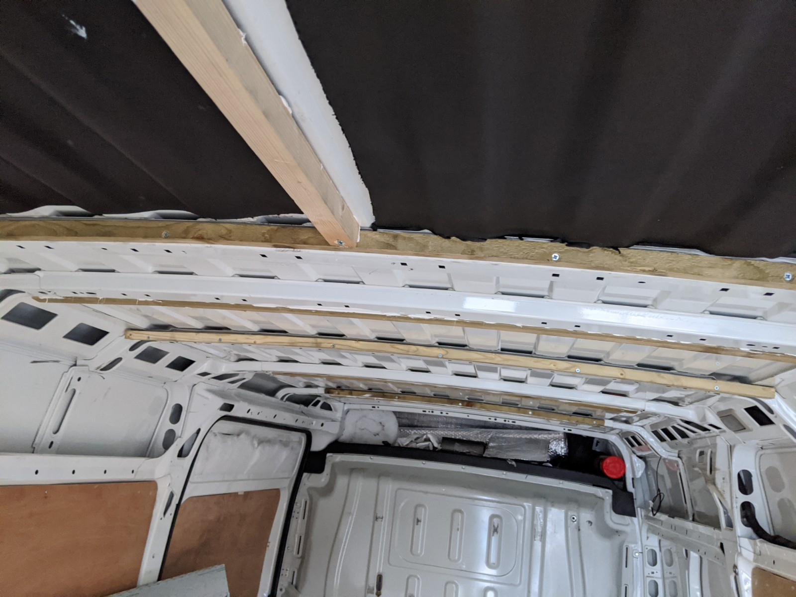
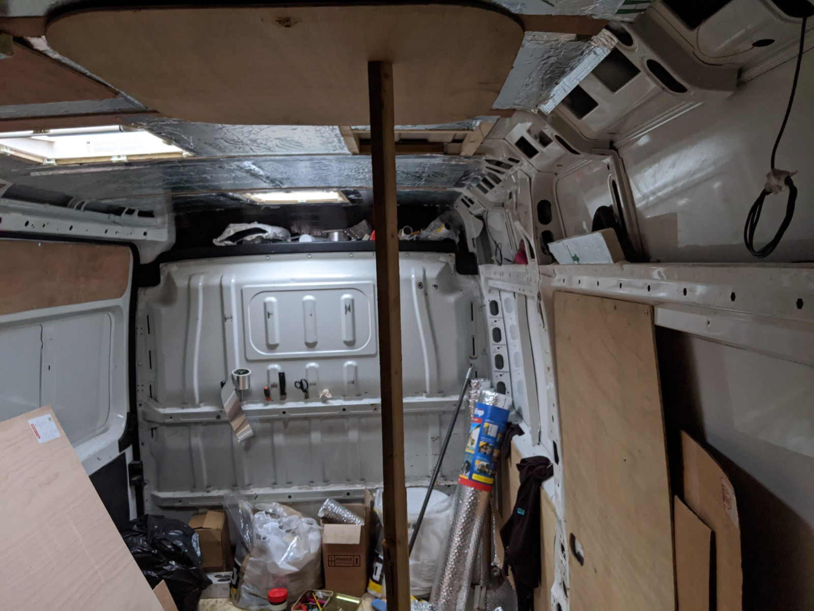
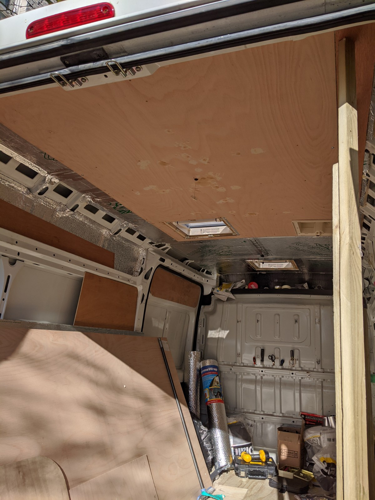

The next skylight went in OK, harder to cut the corrugated roof and a bit more care in sealing but no leaks.
I could get started on the roof insulation, I knew how important this was to get right and also how awkward the job can be.

I'd advise anyone doing this to [watch this](https://www.youtube.com/watch?v=h5W6shYjvhk). This man got it right, I should have listened to him but some other factors made me go in a different and more time consuming direction.
I figured if I could get batons onto the steel strengthening braces at the right angle to force the insulation in between the 'pinch' would help hold everything in place and give me maximum headroom.
It wasn't a complete failure either but I don't own a fancy saw to rip angled lengths of timber and there was a lot of guess work.

There's also a fun filled hour or two of feeding fluffy recycled-bottle insulation into the support ribs in the roof. I got the insulation from B&Q, weirdly no 'real' building place sells it, it's good for van conversions as it has no fibrous dust (just plastic micro-particles). Anyway it was perfect for this job in the absence of sheeps-wool, a really slow and tedious task but it helps eliminate these voids heating up and bypassing all that lovely Kingspan.

Then it was a matter of sticking some anti-vibration foam directly to the roof and forcing the messy Kingspan into the gaps between the batons, I discovered Stixall at this stage, an adhesive sealant which helped hold things up. Also foil adhesive tape over the joins to the batons all held up with wooden props, stone-age engineering meets modern chemistry meets space-age technology.

Now all that awkward batoning would pay off, it was time to panel out the roof with 5.5mm ply and screwing into these batons would be simpler than going into the metal support ribs in the roof of the van. It's still surprisingly difficult to 'find' the supports once a big sheet of ply is resting on your head and you've got a drill-driver in one hand and a mouth full of screws.

#### Learnings:

- Think about wiring for lights before covering everything, I used plastic conduit with string through it so I could pull wires through later.
- Make plenty of props to help hold insulation up while adhesives go off.
- Get someone to help hold the ply up.
- Do it the way that other guy on the internet did it. Far more precise.

