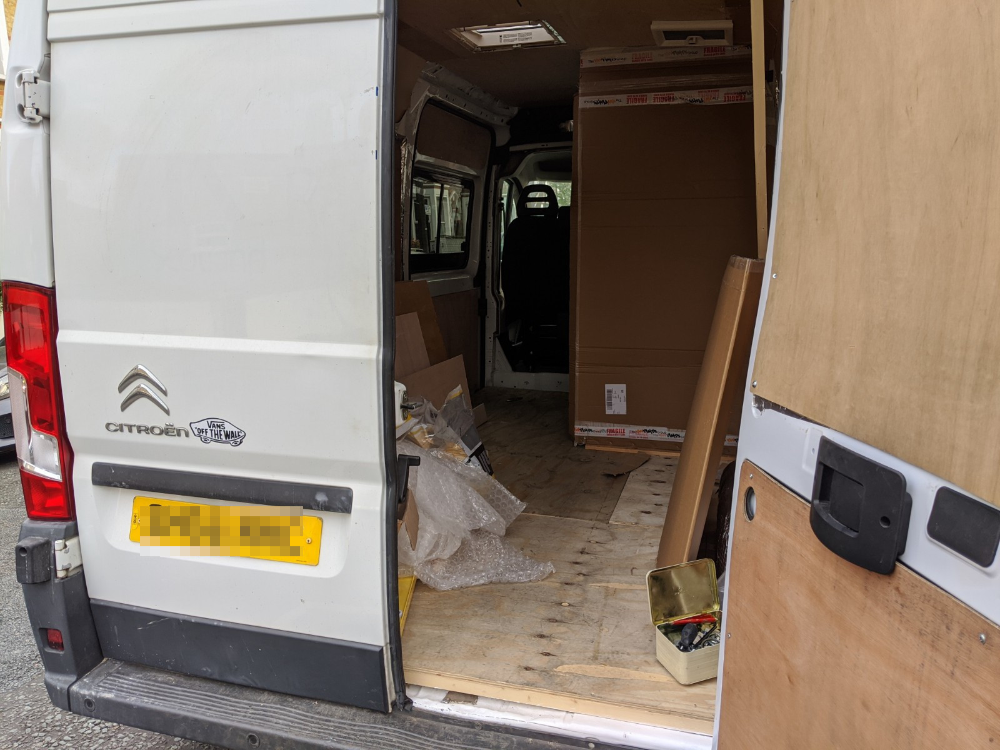
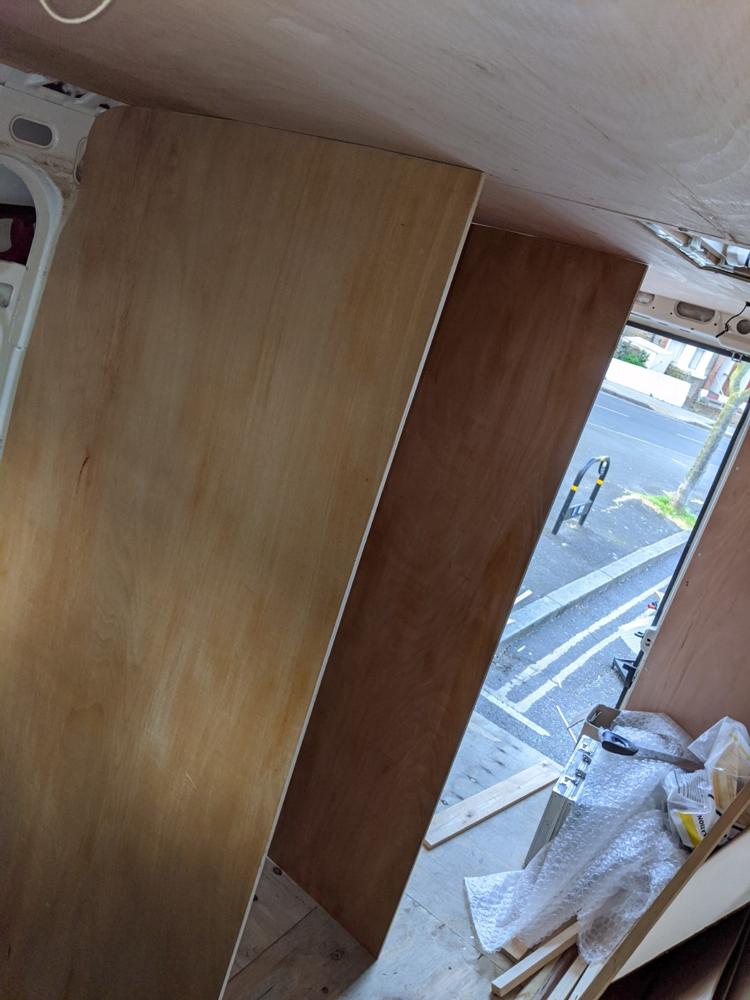
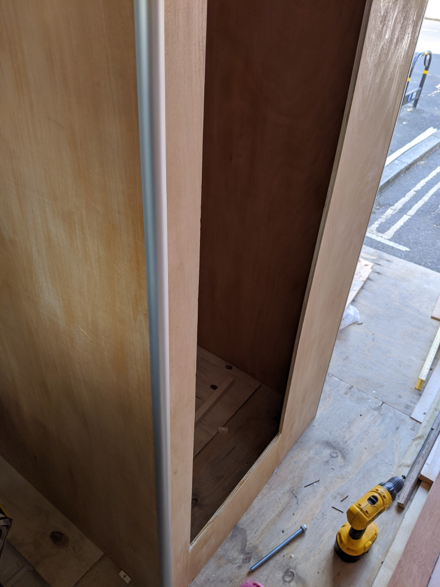

No matter how many times I measured up I couldn't really visualise the interior of the van until I'd laid out some larger pieces. Maybe drawing it out in the floor would havebeen a smart move but at some point you have to put paint on canvas so it was time to build the crapper.

This would sit behind the rear seats and butt up to the edge of the bed. I guessed roughly 800mm x 800mm for dimensions, I probably should have made it smaller as shower trays do not seem to come in that size. I could tell that I was gonna end up with a roughly square floor in there, and I had planned for a tambour sliding door kit to solve the issue of the big hole you enter and exit from.

Caravan grade ply would have been the thing to build it from, at £120 per laminated sheet and £90 per natural sheet I think it would have cost maybe £200 if I'd used the cheaper option. A global pandemic put paid to that though and I decided 12mm ply would maybe do, if it didn't I would rip it out and start over and it wouldn't have cost more than £100.

Scribing to a wonky roof line is achieved by cutting up a load of cardboard till you get near enough and bored enough to start cutting the wood to shape.

Then with a lot of hand sawing (the jigsaw was too vicious in my hands) I got some walls propped up in place.

 To make the corners a bit less pointy I used Multipanel shower panel extrusions, they are made of aluminium and have an 11mm channel. Sanding the edge of the ply walls gave a tight fit and some Stixall sealed the deal.

All in all it feels pretty sturdy and doesn't make any noise when the van is moving, I plan to line the walls with ABS plastic sheet. Finishing the bathroom is quite a way down the TODO list. 
