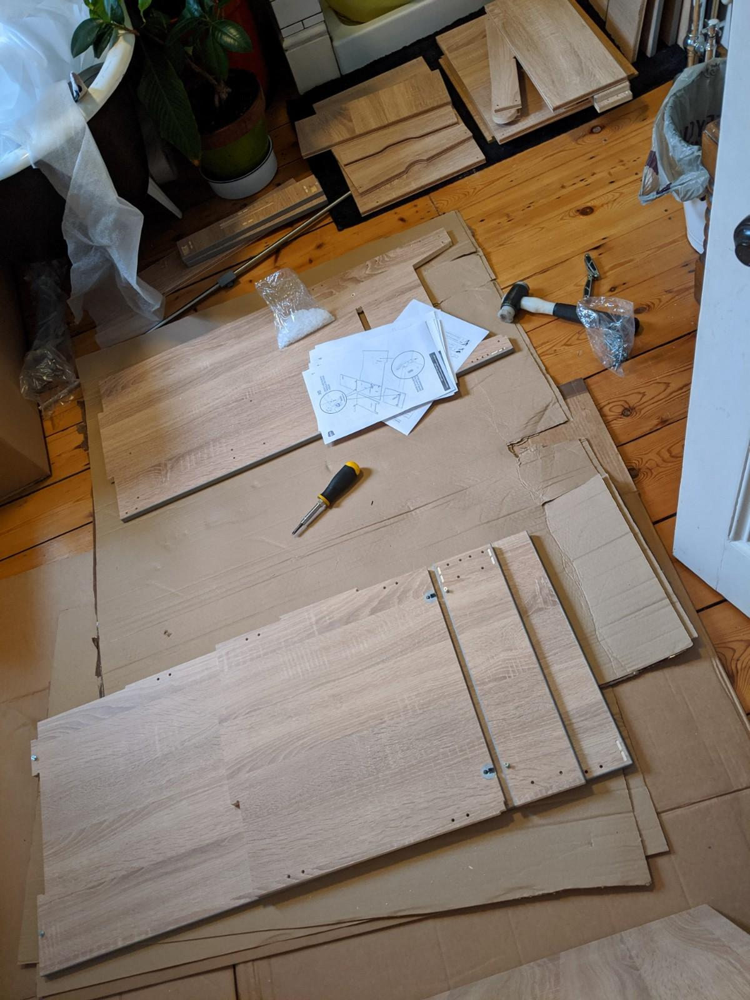
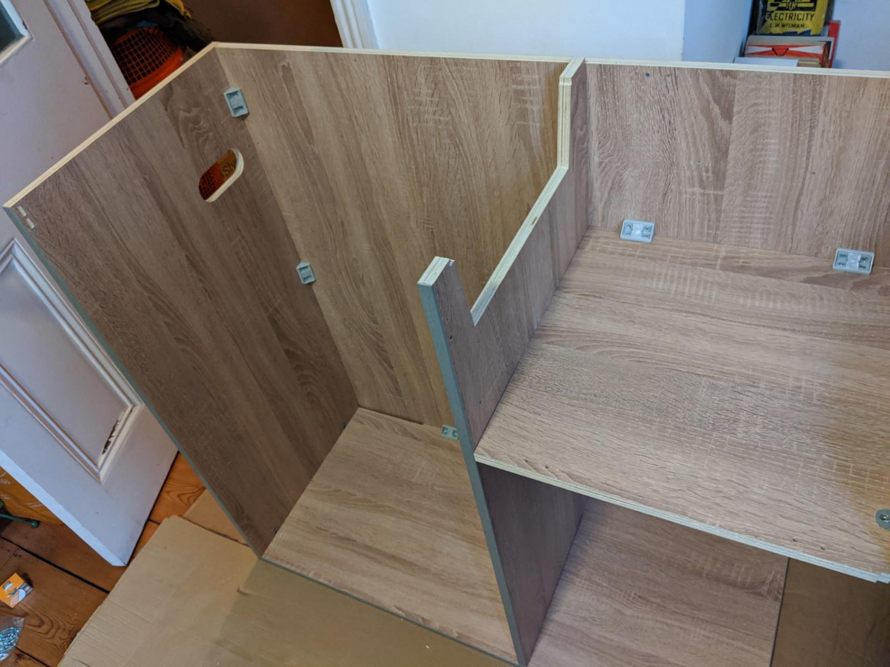
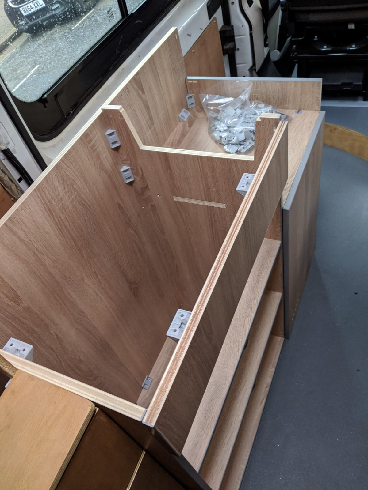
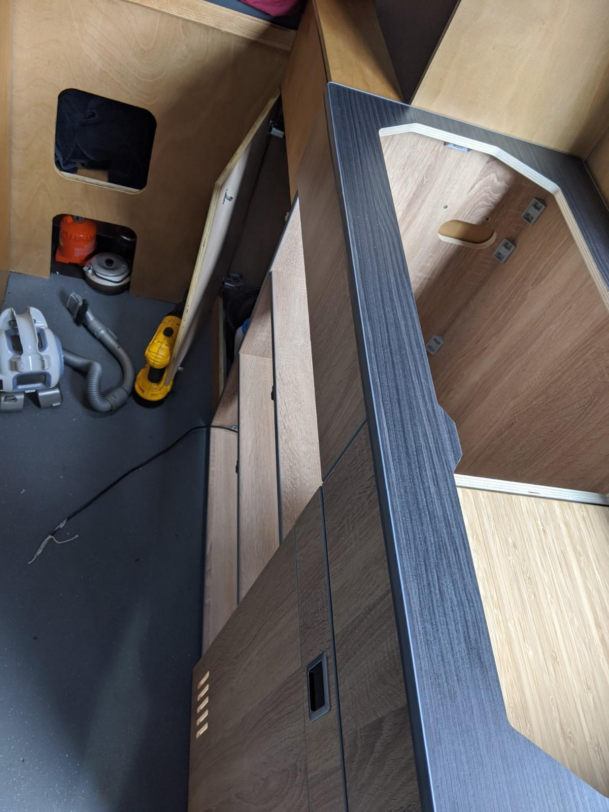
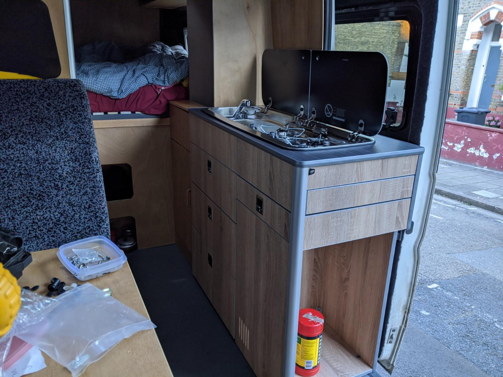

Possibly the most decadent purchase for this van build was the kitchen pod.

I had surprised myself with the woodwork so far, but the chances of me making a decent kitchen with ample storage and a solid, snug fit were pretty remote. I had factored buying a pre-cut kitchen pod from professionals into the build cost. There are numerous EBay listings for these and a variety of configurations. The MDF ones are cheaper but still look like good quality units, however I was conscious of the fact this van wasn't the more powerful model so I erred on the side of lightweight and consequently more expensive.

I took a fancy to the [pods made by EVO Motion Designs](https://www.evomotiondesign.co.uk/product-category/furniture/kitchen-pods/), a firm based in Dorset. They were not the cheapest option but in this case you definitely get what you pay for. They had a pod design which really worked well with the layout I was aiming for, it was free-standing, narrow enough to leave decent floor space and buckets of storage space.

This pod is only compatible with a specific hob/sink unit but this worked for me, giving me a sink on the left hand side and the burners on the right. Time to haemorage money.

The pesky pandemic meant a long lead time, there were probably quicker solutions to be had but this unit really suited the build, so I paid up and waited. To be fair they were close to the estimated time to complete and deliver the unit, but sadly a week later than ideal which meant we had to manage without the cooker or sink in the van. Meh, these luxuries only serve to weaken us, as I like to tell the kids.

When the unit arrived the first noticeable thing was that there was a lot of it and it was all flat on a pallet. Instructions were provided, as were all the necessary fixings and some handy general guidance on assembly. I can't fault how comprehensive the kit was, the only tip I'd give anyone assembling one of these is take your time, find a large dry, clean space, and have a small, powered screwdriver to assist as there are about a million screws to wind in.

As is customary with this build, I decided to do the initial assembly in a small, awkward, space upstairs in the house which also meant lifting and shifting half-way through assembly and then finishing the job in an even smaller space in the van. Total pro. My back is fine now.

Despite what looked like way too many bits to put together, it all happened pretty quick and fairly painlessly. The step by step instructions were pretty accurate (there are a couple of variations of this unit so you had to use your imagination in some steps). I think I could have put it together in a morning if I was assembling it in workshop conditions.

Once we'd completed the fun family interaction of moving the half-built unit into the van I could start to see whether any of that measuring and guestimating was accurate. I was keen to know if our large travel-sick dog would be able to turn around in the remaining floor space in pre-vomit panic? Was there enough room to walk normally, as opposed to sideways like a crab, when navigating from the front to the back of the van? Will the drawers in the unit actually open fully? 
Thankfully the answer on all accounts is yes, it's a decent width gangway given the size of the vehicle.

With the worktop fixed to the base unit and the drawers built and installed on their soft-close sliders (we don't have this sort of luxury in the house), I was feeling less bruised by the mauling my bank account had taken, the storage space is great, the large, deep drawers have plenty of room for all our pots and pans and tinned goods. I'm a stickler for keeping the weighty things near the floor wherever possible.

Time to test fit the cooker unit and start dealing with the plumbing.

I'm not quite done on that front yet as there's a bit of wiring and gas piping to do, I want to get this nice and tidy and obviously safe and conforming to regulations.
I'll update this post once I've successfully cooked a fry-up on it.
