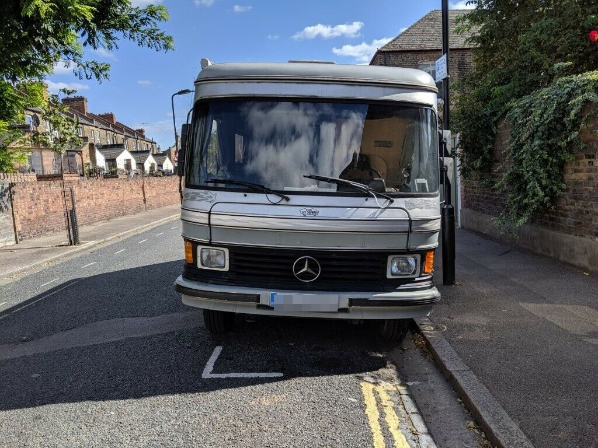

It always starts with a dirty van.

The Low Emission Zone changes in October 2020 meant that our classic 38-year-old, slow yet beautiful Hymer motorhome had to be moved on.

I'd always fancied the idea of doing a DIY conversion and the cost of something EURO 6 compliant ready converted was
way beyond what I could afford.
The go-to van for conversions is the Fiat Ducato, it's lightweight for its size, smaller folk like me can sleep across-ways in the back and it's pretty economical.
Newer models come with EURO 6 compliant diesel engines and they are pretty reliable, for these reasons the prices are pretty high.

The poorer cousin of the Ducato is the Peugeot Boxer and the identical yet even less desireable Citoen Relay (known as the 'Jumper' outside UK).
The Peugeot and Citroen vans come with PSA HDi engines, less performant than the Fiat machinery but still pretty well-proven lumps and they are EURO 6 compliant from mid 2016.

This still meant a hefty price tag as anything EURO 6 is sought after and anything EURO 5 is cheaper but a false economy in London given the LEZ charges. Also pollution, think of the little children, their poor sooty faces.

I settled on a CAT S salvage, 66 plate Citroen Relay 2.0HDi from [Thames Street Auto Salvage](https://tsasalvage.co.uk/), no V5, no MOT, bad paint and a few dents, hence the CAT S. The van cost me a lot less than a similar age and mileage van would have done from Autotrader and the likes. It was a risk but I was hoping I knew enough to spot a dud and the van ran well on the test drive. TSA were really straightforward to deal with, I'd never bought a salvage motor before and was nervous about how much money I was spending, they were really honest about what was for sale and we did a good deal.

The van had been a works motor for a Scottish Railways welding contractor, there was a ton of metal swarf in the back, lots of empty bags of weed, king-size papers, a weed grinder and so many boiled sweets fused to the floor. It was like the set of a Weegie Cheech and Chong film.

The back of the van was racked out and lined, the ply floor was a mush of cutting oil, urine, bits of metal and ganja paraphenalia, all of that had to come out.
The ply-lining on the walls was usable so I kept that back.

