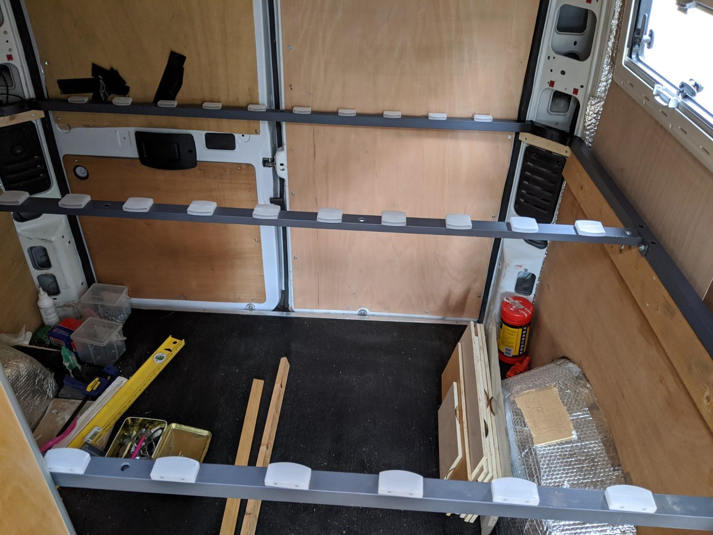
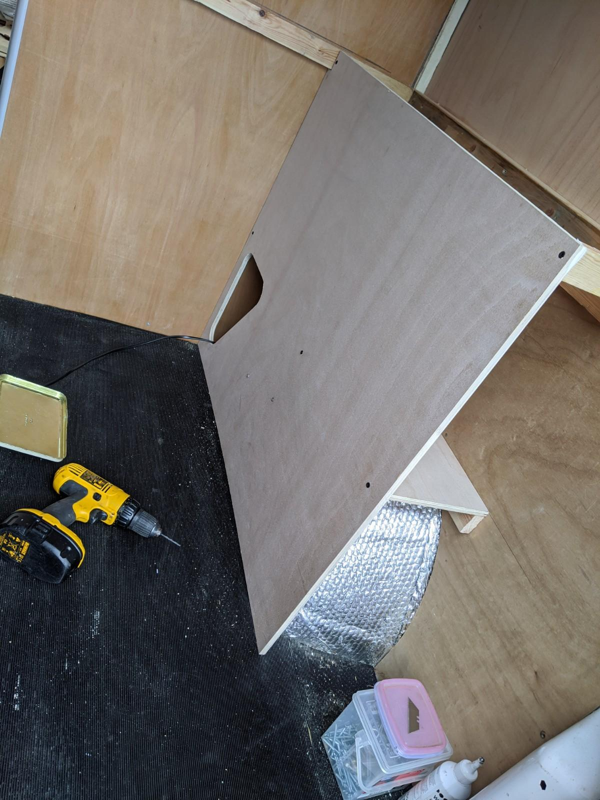
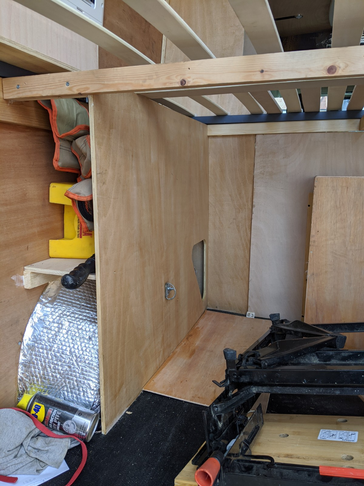
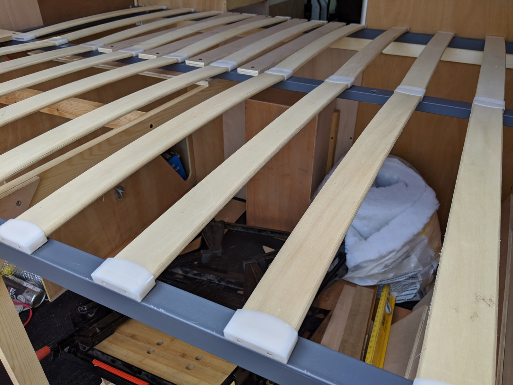
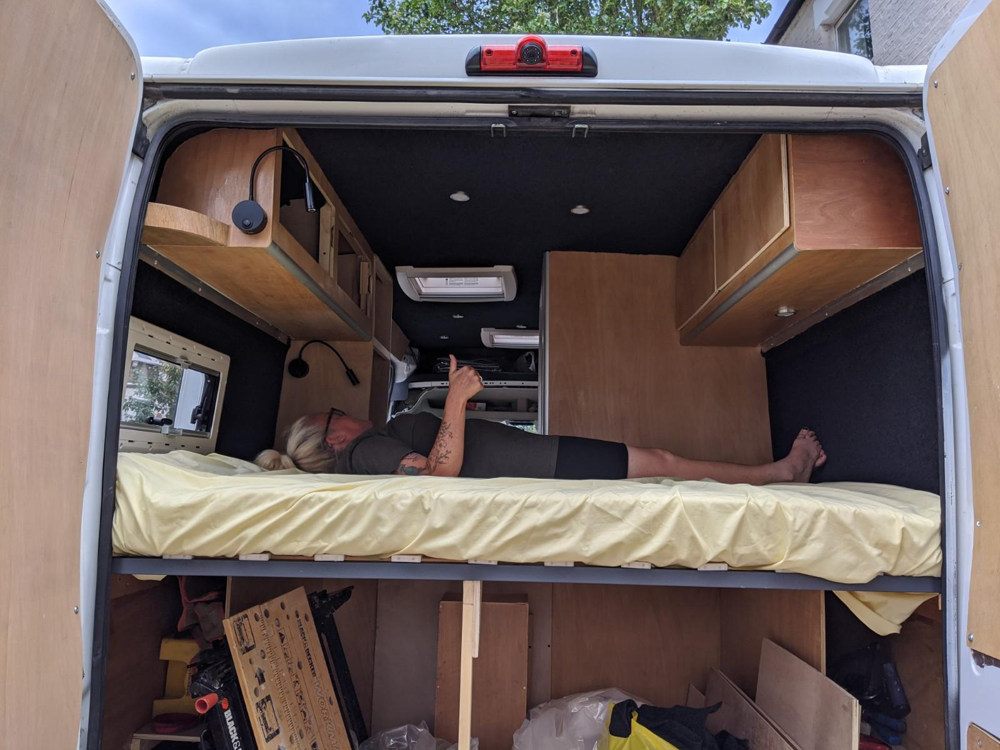

Around the time I bought the van, I found a bed frame and slats dumped in the street near my house. It sported a few of the qualities I was looking for:

- No noticeable smell of canine or human urine
- Lightweight _waffer-thin_ bolt-together frame
- 137cm full double size
- Easily replaced bowed plywood slats
- Free

It seemed like a good shortcut rather than building a bed for the van, I've done this before and it's pretty simple but the wood costs money and building entirely in wood makes the bed quite heavy. I could have repurposed a couple of pallets or something similar but this looked worth a go.

I wanted the bed to be snug in the back, ie. right up to the back doors. The rear corners of the van cut in with a diagonal metal frame for strength and housing the rear lights, so the rectangular bed frame would need to be adjusted into an irregular hexagon. A bit of cutting and welding later and I had something to fit. I could have omitted the welding bit as lopping off the bits in the corners and screwing in wood to make up the shape would have been just as strong, but welding thin metal is a challenge so I had a go.

I also wanted the bed to be quite high up as I wanted plenty of room for bike and holiday-tat storage underneath. Also high up beds tend to repel most dogs. So I screwed some supports to the van's interior metal frame which runs roughly 80cm above the van floor. All good and solid.

At this point I realised the bed was the last thing I wanted in my way while I did all the other stuff in the back of the van, so it sat in the shed for months.

I had dispensed with the original wheel arch boxes as they were evidently contributing to the bad smell that came with the van. The area above the wheel arches is dead space as the arches slope and don't make for good shelves.

So as part of making the crappy bed frame stronger and making some storage space I decided to wall-off the arches and make a long flat shelf for camping gubbins.

These are pretty handy as I can fit a couple of camping chairs and the van levelling chocks in them, they weren't too time consuming to make. I've secured them to the metal wheel arch with bolts and I may put some more strap anchors on them to keep stuff from sliding about in the back. I slapped on a quick coat of polyeurythane varnish for protection.

The most time consuming bit was my OCD about using up dead space behind the wheel arches. I used a large hole-cutting bit and hand saw to cut a round-triangle out so that I could store stuff in this little spot. I've already crammed in a litre of engine oil and litre of power steering fluid and a bottle jack in them so the extra effort feels worthwhile.

The bed frame needed a bit of additional support as it was made of thin box steel so I ran a 50mm x 25mm baton from one side to another. The wheel arch storage compartments providing additional support. It feels sturdy and I've slept comfortably on it (more of that in a later post).
I've also added a few slats where you climb onto the bed, these might be surplus once a proper mattress is in place but it seemed sensible for clambouring about in the mean time.

There are only a couple of jobs left in the bed/boot of the van now:

- Lining the ceiling and walls with stretch carpet (DONE!)
- Adding a small shelf to 'finish' one of the cabinets as it looks a bit scruffy (DONE!)
- Wiring in a reading light
- Wiring in a boot light

Then I can throw the new mattress in.

**Update**

The bed passed official inspection.

