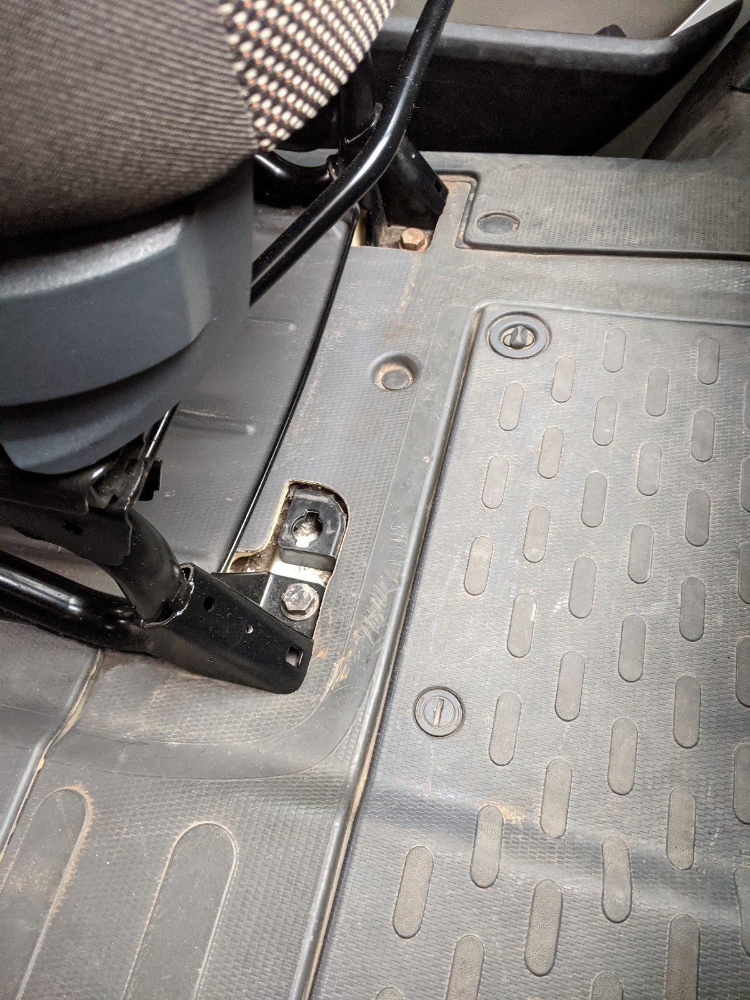
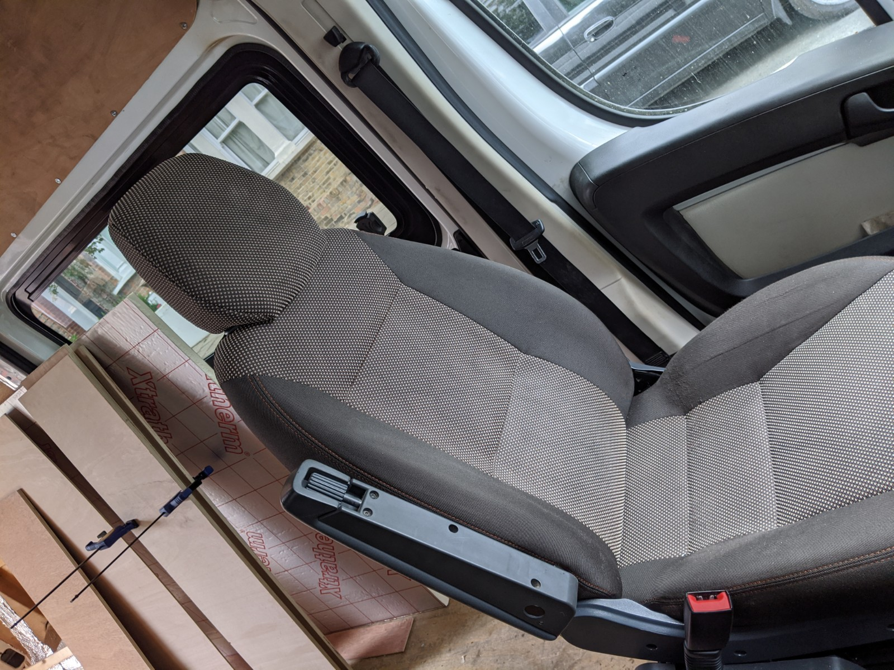

Certainly not the cheap seats, the single front passenger seat for a Ducato / Boxer / Relay is a pricey part to buy.
Even secondhand they cost ten times the amount of a used double seat.
I was lucky enough to find a single seat in good condition, and fairly nearby, not matching upholstery but I don't have eyes in my arse.

Swapping the seats is very simple, the seat is secured by two 19mm bolts at the front and slides under two domed bolt at the back. So when you take out the front bolts the old seat can be moved forward and released from under the domed bolts.
The fittings are the same for double and single seats, so swapping in the new one is the reverse of removal. The double seats are pretty heavy so I enlisted help for moving seats out of and into position as it's the sort of job that ends with a bad back.

It was a 10 minute job, lovely, swapped straight in with no fuss. I sat in my newly installed single passenger seat and surveyed the dashboard, absent-mindedly I tried the seatbelt. It would clunk but it would not click. 
The belt socket/receiver is bolted to the seat, so the one on the new seat appeared not to work.
I tried a few things like swapping the belt socket from the double seat (it's not compatible), scratching my head, swearing and staring moodily at the dashboard, then noticed that the belt plug is different on the drivers seat to the passenger side which had a double seat. There's a bit of a cutaway on the double seat belt plug which explains the lack of click. So when doing this seat swap from double to single, buy a belt reel for a single seat too.

After haemorraging money for the single seat I wasn't in a spendy mood, but I commenced muttering at eBay to find the right part numbers and get a single passenger belt.
I discovered that the inflated price of the single seats also has an undesireable effect on the price of a *single passenger side / nearside / left hand belt*. 
Studying the part numbers for a bit helped me identify that the drivers and passengers belt reels are identical and that the part hasn't changed in a decade or so - an older intact drivers side part would do just fine (Part No. 735429776) and was about half the price of a *passenger side belt*. You have to admire the marketing.

Removing the old belt is as simple as removing the various plastic covers over the belt reel mechanism and fixings, undoing three securing 17mm bolts, one holding the reel, one for the other end of the belt and one for the hanger bracket, then installing the replacement with the same 3 fixings and covers, another 10 minute job.

Now we have a clunk and a click.

#### To be continued

I still plan to put seat base swivels under the seats as these will face into the rear to make up the living area. The parts are readily available so I'll get to that soon.
