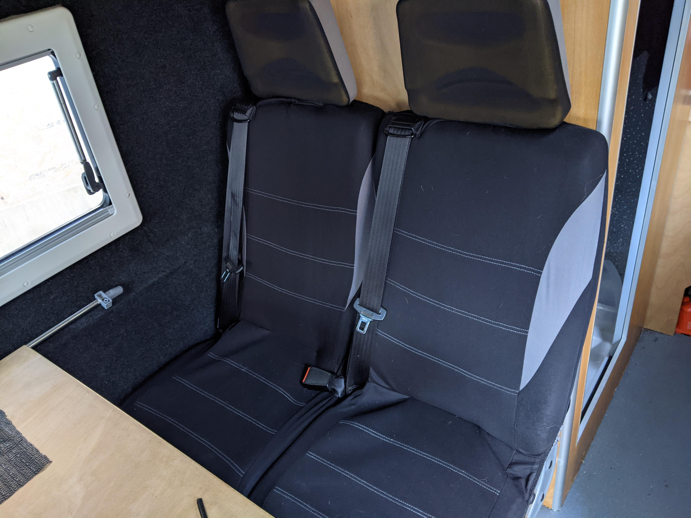

With the roof 'mostly' insulated and ply-lined I could start to think about the complexities of adding rear-seating.
One of the things that freaked me out about our old camper was that people just sat in the back in the vague hope we didn't hit anything.
I was determined to fit this van out with rear seatbelts and make sure the floor anchors were up to snuff so that meant doing this ahead of most other jobs, I needed access to the bare van floor and I was sort of guessing at the space I'd need for leg room.

Measurements were taken from the rear doors. I knew how wide the bed would be, then there would be a bathroom cubicle then the seats.

I bought some ex-minibus seats on eBay, for £40 they were in OK condition, had working built-in belts and width-adjustable legs.
There was a lot of guestimating going on by now, the floor of the cab is approx 130mm higher than the cargo bed floor. The plan was for the driver and front passenger seats to swivel round to face into the back of the van so I wanted all the seating at a similar height. I knew I'd need some sort of funky raised floor to make this work. Internet research of **proper** van conversions showed how this was done. The minibus seats weren't nearly high enough so they would need a boost. To the shed!

I welded up a hefty frame I planned to bolt down to the van floor using some 3mm box section steel. Please feel free to judge my welding, it's not what I do for a living.

Painted it and messed around until I had it bolted through the van floor and reinforced with spreader plates. Took a while and would have been quicker with two people but I got a lot of exercise.

I couldn't just install the seats though, there was the matter of that raised floor and linked to that was where some of the essential electrical components in the build would go. I needed to find a place for a hefty leisure battery and a hot air heater. There was a compound set of jobs which all ran into one another, this confused my 'one thing at a time' system.

The next photo is a bit out of time sequence as I did some other jobs in between but hopefully it gives a picture of what the false floor would look like with some of the electicals installed. I've added a split charge relay from the starter battery which charges the leisure battery. The heater is a Chinese knock-off of an Eberspacher diesel-powered heater. It's thermostatically controlled, runs off a supply from the fuel tank and exhaust gases are piped out through the floor and clear of the bodywork.

Getting all this lined up was time consuming. I wanted the big win of installing the seats with 4 heavy duty yet 'simple' fixings but that had to wait till all the flooring woodwork was in place.
Thinking a bit harder about how the seats were to be bolted down to the frame may have simplified this process. With the benefit of hindsight using a captive nut or welding a nut into the frame would have made them easier to fit and remove.

#### TIL:

- Rivnuts, these rivet-like captive nuts would have been much easier to insert into the frame where the seats bolt to them.
- Conical hole cutters are magic.
- One person under the van and one inside the van would have speeded this process up by 66%.

#### Update: Here's a picture of the seats with cheap and slightly customised covers.

