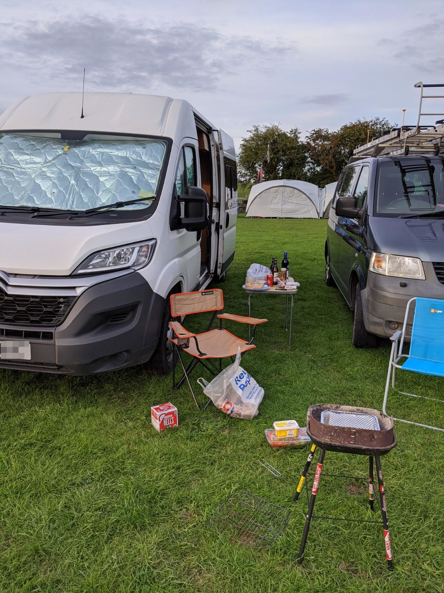
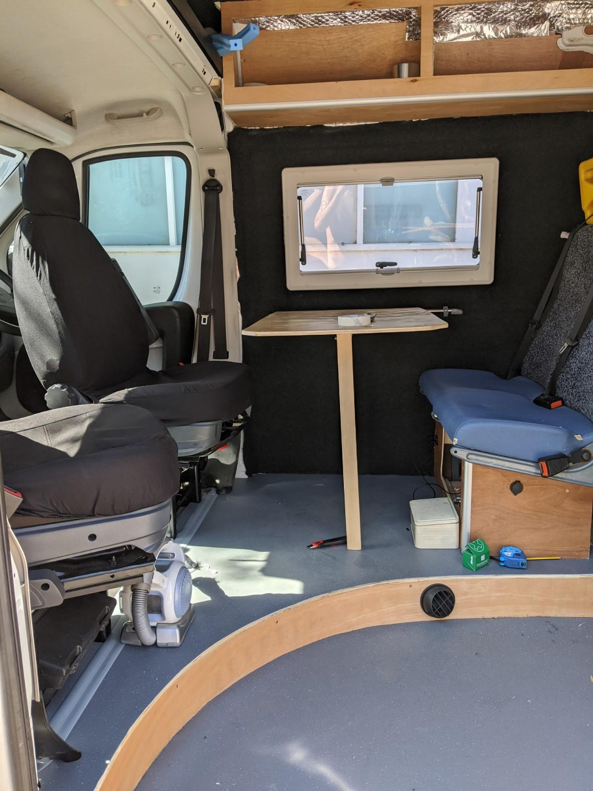
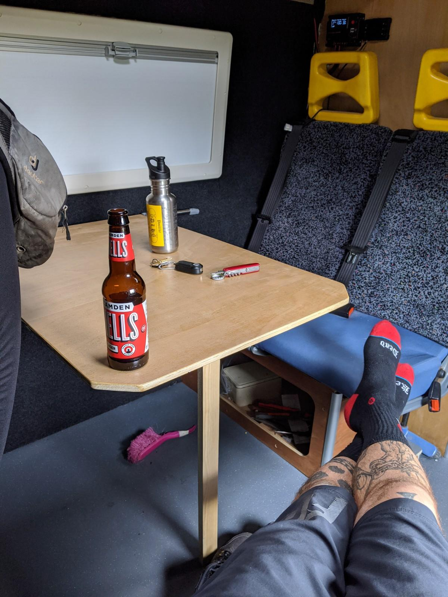

About half-way through the build and half-way through a pandemic infused summer, it was time to take to the road in the new wagon.

I did an initial run to the Forest of Dean with my beloved mountain bike to check for squeaky furniture, loose screws and shonky wiring.
After a 500 mile shakedown nothing had fallen off the van and nothing had hit me in the back of the head under heavy braking, a couple of little furniture related noises which were quickly eradicated with wood frame sealant.

Now for the family camping trip, a short drive to Kent in a gale with a large, travel sick dog, plus enough camping equipment and dry contingency gear for 2 kids. The van was pretty stable even in 48mph gusts of wind, not super speedy but we were pretty loaded up with equipment and certainly a lot more poke than the previous 38 year old Hymer, we managed about 55mph on the long uphill stretches and cruised happily at 65 - 70mph, it also felt less like driving a canal boat on the windy roads. 

I had taken the precaution of getting the front wheels balanced (Cheech and Chong had kerbed it pretty hard) and replacing the rear brake shoes / adjusting the handbrake myself the week before, no dramas, it went straight and stopped easily.

Pitching a 4 person tent in what is classed as a 'Fresh Gale' on the Beaufort Scale is quite a skill, it mainly involves using children as ballast and doing as much pegging as possible before trying to put the thing upright. No children were lost to the winds that evening though, we provided them with fire-warmed bricks at bed time: central heating and more ballast.

No such worries for the elite club allowed to sleep in the van though, adults and dogs enjoyed gale free comfort, the only things we were lacking were a wash basin, sink and cooker, so an awkwardly low camping table and washing up bowl were employed to round out the homely feel.

The next day was still and sunny, a welcome change from the day before. First thing I noticed waking up in the van in direct sunshine was that the insulation over the bed and living area did a great job of repelling heat and the bits of still-bare interior warmed up pretty quick. So finishing up the loose ends of insulating bare metal is a must.
The weather also stress tested all those sealant joints on the exterior of the van, no leaks to report so I was pretty happy with that.

The swivel seats are great for a bit of comfort but they also make the van feel pretty roomy, no kitchen units in the van at this point so we had plenty of space for dogs to occupy. The full double bed was also a hit, a cheapish memory foam mattress worked great with the recycled bed, all felt sturdy and there were no major violent territorial disputes. The only slight inconvenience were those above-bed storage lockers. If you are a bit tipsy or gung-ho the odd mild head injury is possible, but you have to really sit bolt-upright in a hurry to do this. I had spent a few nights in the van previously so I kinda knew what to expect. It's quite funny listening to someone else adjust to the environment in the dark though.

The LED lighting all worked great and a fairly cheap tailored set of sun blinds for the cab (£40 from Ebay) made it feel cosy inside.

