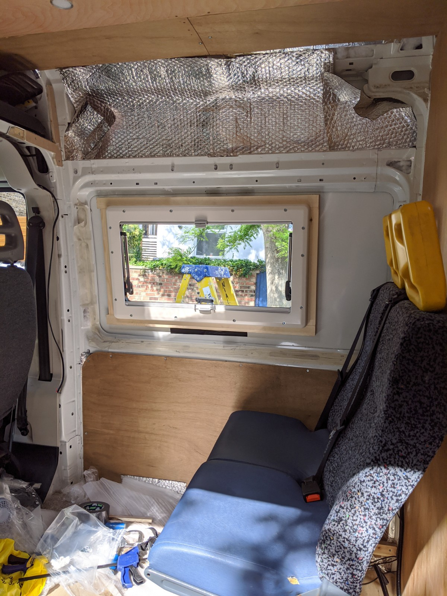
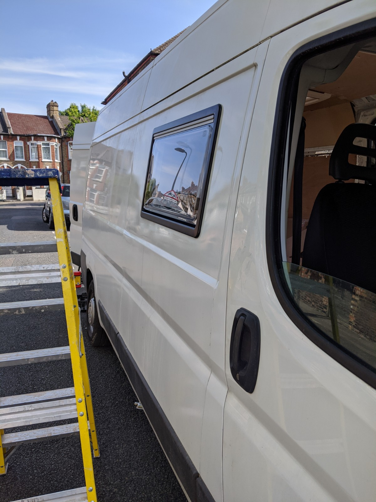
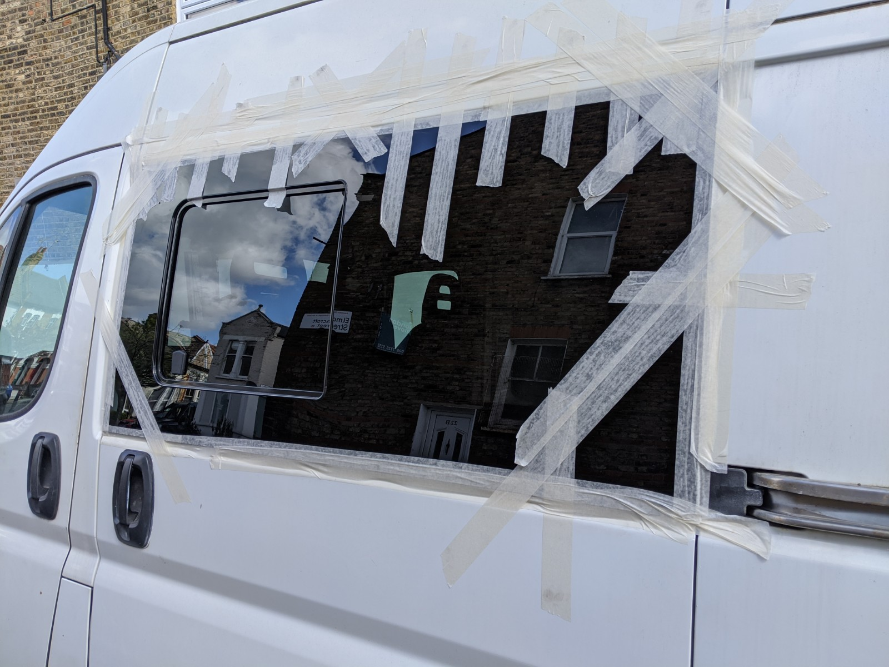
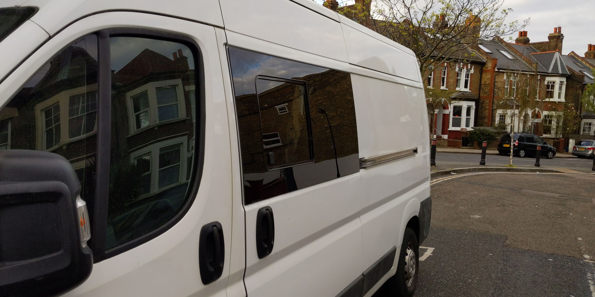

For the windows I'd decided on a tinted bonded window for the sliding door and a Seitz S4 double glazed window for the dining area.
I also ordered a smaller window for the bedroom area. The Seitz units come with built in fly screen and blinds and are pretty easy to fit. There are lots of good YouTubes on how to do this. Fitting was painless, I'd learned from fitting the skylights that having the frame ready made helped with positioning things, so my order of execution was:

1. Make wooden frame for window and ensure it's a snug but not tight fit between in the inner and outer parts of the window.
2. Tape the frame into position inside the van, this wasn't tricky as it was a side panel, just had to remove an anti-vibration strut.
3. Mark around the inside of the frame as the basis for cutting the panel.
4. Drill a 3mm hole inside each corner of the marked out rectangle.
5. From outside mark out the rectangle again using the 3mm holes.
6. Use an angle grinder with a 1mm slitting disc to cut the rectangle out.
7. Use a sanding flap disc to clean up the cut panel and paint any bare metal with Hammerite.
8. Put a bead of sealant around the outer frame of the window, there's also a rubber seal there so keep inside that.
9. Get someone to hold the outer window in place while the inside frame is screwed into place, this makes a sandwich around the van wall and the wooden frame and you can tighten gradually and carefully as you are screwing into plastic.

You can see the wooden frame sandwiched against the van wall above, there's more insulation and ply lining to go around this. 

From the outside the installation looked pretty good:

For the bonded window, I followed [what the experts say on YouTube](https://www.youtube.com/watch?v=nBFGg1jyp1c&feature=youtu.be). The key thing here as with all these adhesive sealant-based jobs is preparation. A nightmare for someone as impatient as me, but getting all the surfaces clean, the paintwork keyed up and cleaned down ready for sealant was worth the time. I did run a bit thin on one tube of sealant, if I were to do it again I'd have a spare tube handy. It's important to use proper windscreen grade adhesive. The kit I went for came with black Bostik Simson ISR 70-08 AP.

Cutting the hole for the bonded window requires less precision than the Seitz one, the window hole just needs to be a lot smaller than the window so there's plenty of room for bonding adhesize. I just followed the line of the inner skin as per the video above. The window was specific to this model and wheelbase of van and [Vanpimps](https://www.vanpimps.co.uk) were really quick to deliver it.

The usual dressing the cut metal with Hammerite and keying up the van door paintwork jobs and we were ready to fit.
These windows are big and unwieldy, you have to try not to get greasy paw prints where the adhesive is about to go so clean hands, window, paintwork.
I opted for piping the adhesive onto the van door so we could lift the window without worrying about it, I ran out of adhesive on the bottom seal, very glad I started at the top. 
We then lifted the window into place and pushed it hard onto the bead of adhesive. The video above says to use cardboard to prop the window in place while the bonding adhesive goes off, this prevents the window from sliding down on the drying adhesive, this wasn't possible given the shape of the door, there was no 'lip' to jam cardboard chocks into, so I opted for waaaayyyyy too much masking tape, this worked fine.

I ordered another tube of bonding adhesive as the bottom seal wasn't complete, the window was well fixed by now but needed completing. From the inside using a sealant nozzle, I could pipe in the rest of the seal.

The window looks great and has not fallen off the van. I'm always a bit sceptical when glue is the only thing holding stuff together but follow the instructions and this method works really well. Bonded windows are cheaper than the plastic double glazed ones, I figured this side of the van would be for the kitchen so I didn't need an expensive double glazed unit, it will need some sort of sun blind though as the single glazing will transfer heat into the van quite quickly.

