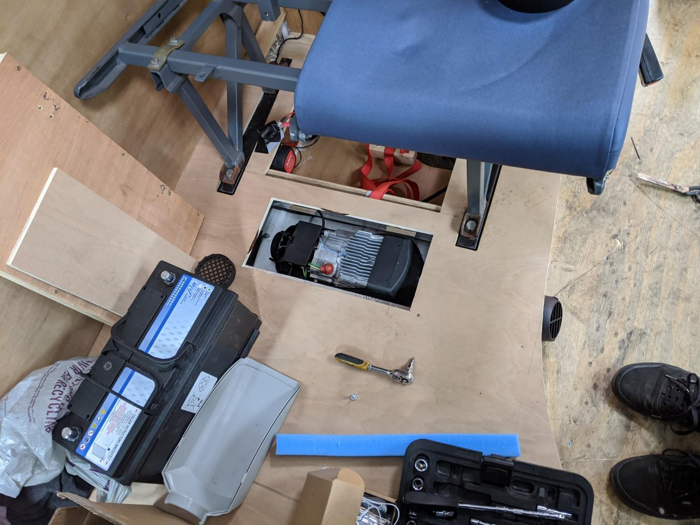
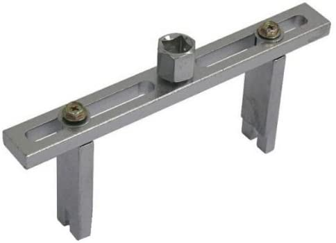
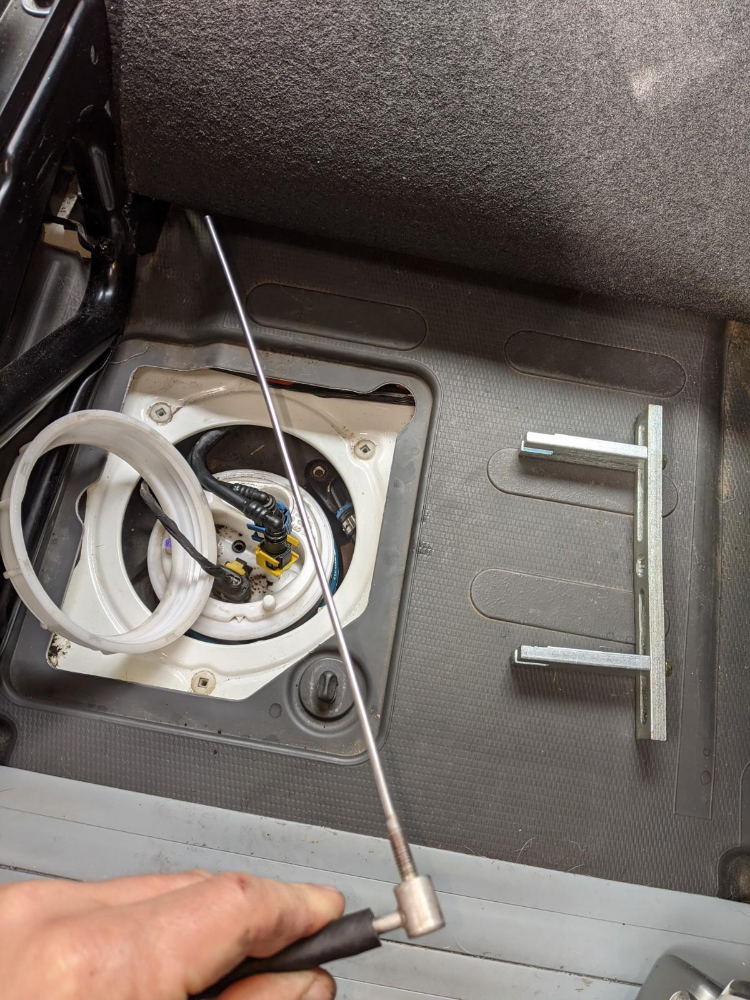
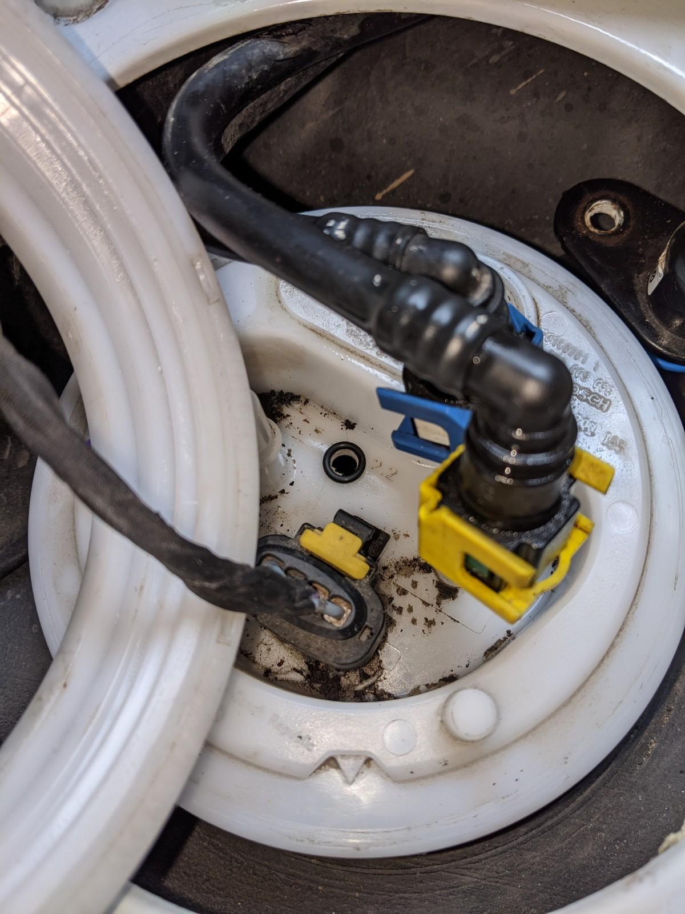
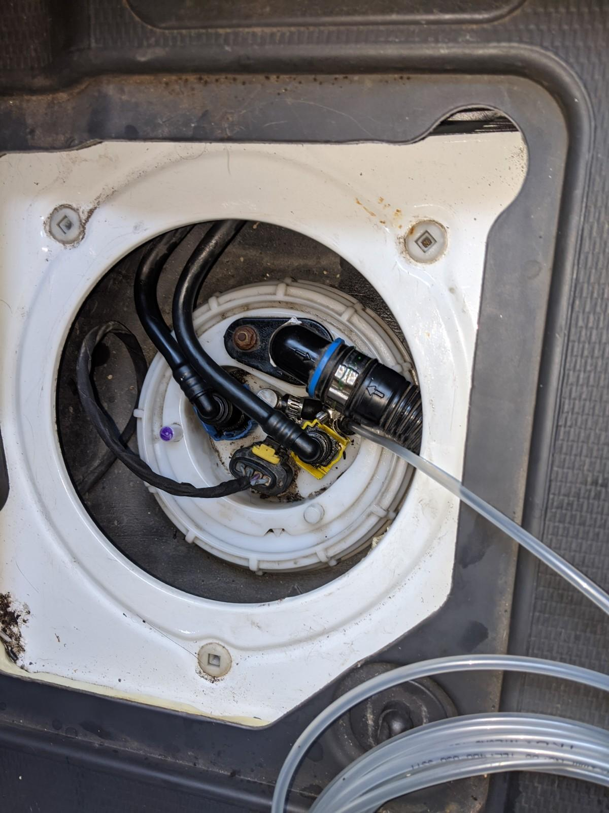
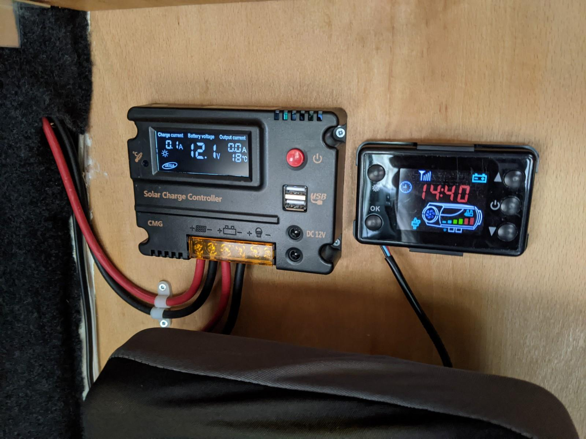

I'd half-installed a cheap Eberspacher-esque diesel powered heater when I built the floor in dining area. This involved making holes for the air inlet, exhaust pipe and fuel inlet in the van floor. I had run the hot air pipes under the floor and connected the wiring loom to the battery, by this time it was summer and heating the van seemed a long way off.

All that remained to be done was getting a fuel supply to the heating unit. The heater kit comes with a 10L tank which would be simple to fit, but then having 10L of diesel in the van is a bit too swampy for me these days. Also I would consistently forget to fill it when I needed it most.

The slick move is to tap into the fuel supply of the van. Modern common rail diesels usually have a fuel pump inside the tank which provides fuel at a decent rate. I was keen not to disturb the fuel flow to the engine so a standpipe into the fuel tank seemed to be the best approach. Many Youtubes exist detailing how this is done, I mostly followed them with one slight difference.

The fuel pump / sender unit is located between the seats in the cab under an access panel. The unit is secured by a large circular lock ring. A special tool is needed to get this undone.

The strategy was to not get diesel everywhere, so the plan was to do everything in situ rather than pulling out the sender unit and dripping fuel everywhere. This would involve lifting the sender/pump unit up enough to get a cloth under it, drill a hole through it for the standpipe (if it went wrong, replacing the sender would be easier than replacing the tank), and catching any plastic swarf in the cloth so it didn't end up in my fuel lines.
Then I'd install the standpipe and replace the sender.

I had about half a tank of diesel, so I wasn't in danger of it overflowing once the sender seal was broken. There is a rubber seal between sender and tank which you have to be careful with, it can fall into the tank or not seat correctly again which will mean a leak if you brim out the tank.

An element of panic is introduced by the manufacturers with a safety system which, if it detects a problem with fuel flow, cuts off fuel supply from the tank. This means disconnecting the electrics from the sender would leave me 10 minutes to do any work before this safeguard kicked in. I had serious doubts about drilling the hole, fitting a grommet and cutting the standpipe to the correct length (I didn't want it drinking _all_ my diesel) and reconnecting the electrics in the alloted time.

Thankfully once I got to work I realised there's a pretty generous wiring harness for the electrics and by unclipping the fuel and breather pipes I could do everything in situ without touching the wiring.

A few nervous seconds of drilling through the plastic sender top and clearing away a small amount of plastic debris I had a standpipe of the correct length tightened in place.

I replaced the sender unit and felt a small amount of relief that nothing seemed to have fallen into the fuel tank. I had checked the seal was in place before tightening the lock ring.
Next thing to check was if the van still ran OK, no problems there.

After this I had to connect the standpipe to a fuel line which ran under the van to a fuel filter and a metering pump.
I chose an incredibly difficult location for the pump just between the Adblu tank and the fuel tank. My thinking was there was already a bracket to bolt the metering pump housing to, and that it was inbetween the fuel tank and the heater unit. Despite this being damn fiddly to get to, it was a good choice in terms of pump noise and being protected from the elements.

Once the wiring loom from the heater was connected to the metering pump I had to prime the heater (get fuel to the unit and purge air from the fuel line) as per the semi-inteligible instructions.
Then it was test-run time. I'd bought a fire extinguisher, just cos they are a good idea when cooking in a van, so I felt like I had a backup plan.

Pleased to report everything went according to plan, the digital controller allows you to set a target temperature and it will run the heater (somewhat noisily) until you get the van warm, then it runs at a less frantic pace to maintain the temperature.

Perfect for those muddy wet winter rides.
