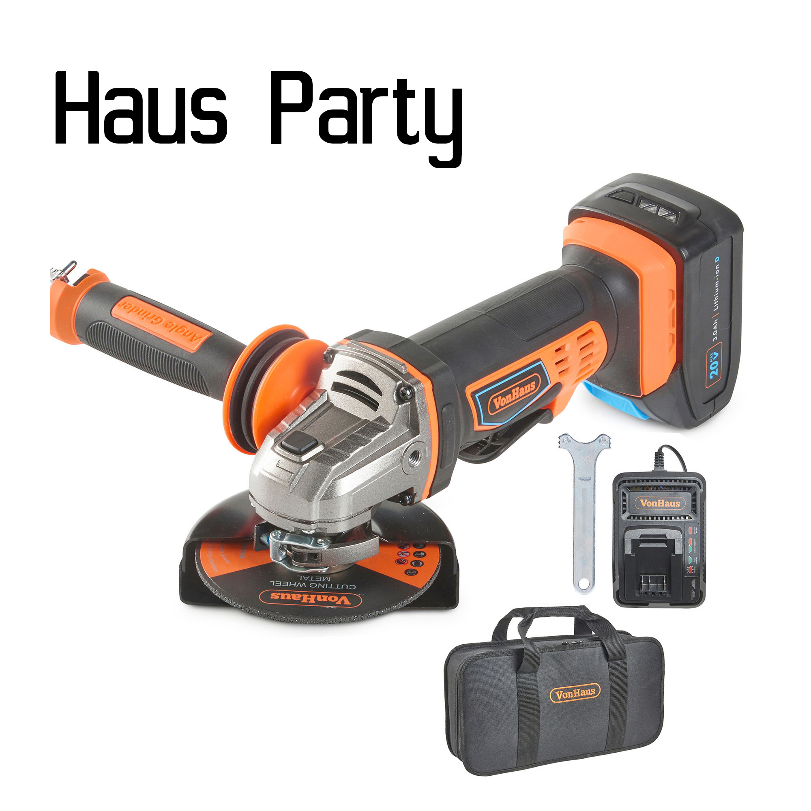
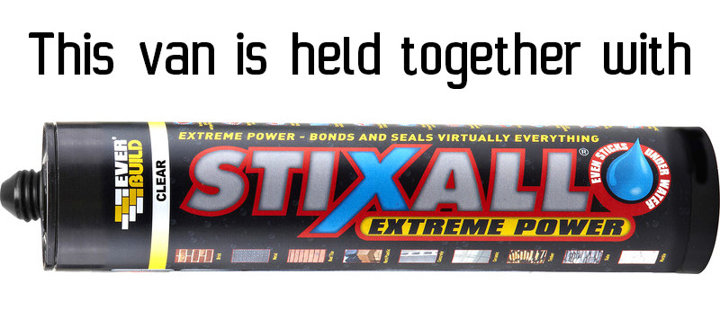

I think I'm roughly half-way complete on the build, so I thought I'd list tools and materials I've used, what worked well and things I learned when doing specific tasks.
A few people I've chatted to about doing van conversions have asked what type of sealant or adhesives I've used, so maybe this will be useful to other people thinking of converting a van.

### Tools

- Decent work bench: I had a sturdy collapsible work bench, the minute it takes to set up is a minute well spent, makes measuring, cutting and drilling a lot simpler.
- Angle grinder: This is marginally easier to use than a jigsaw when cutting metal. It's also pretty good for 'slotting' wood (eg. for cutting cupboard facia apertures). 1mm slitting discs give you a lot of control when cutting a van roof or wall. I bought a cordless 'Von Haus' grinder for about £90 because I was working in the street. It's cheap but it has proved reliable, non-lethal and invaluable.
- Cordless drill/driver (x2): How many times can you change a drill bit in a day? A lot more times with one drill. A lot of jobs revolve around drilling and then countersinking and then driving screws in. So a couple of drill/drivers and a couple of batteries for each helps a lot. Also don't be shy about buying lots of small drill bits, they snap and roll away into a parallel universe frequently.
- Conical hole cutting drill bit: Drilling big holes in metal with a big drill bit works - eventually, you'll use more battery and blunt the bits. The conical stepped cutting bits you can get for £15-£20 are money well spent.
- Fine tooth saw: Many people asked me why I wasn't using a jigsaw, and I did use a cordless jigsaw a few times but for a straight controllable cut you couldn't beat the monotony of a fine toothed woodworking saw. Dirt cheap and it won't completely mash up plywood edges. I think my inexperience with power tools cost me a bit of time in this area but I got the results I wanted with a hand saw.
- Woodworking clamps: A couple of cheap 'quick-clamp' style woodworking clamps and some older screw thread ones were essential for holding glued bits of furniture together until set.
- Pencils: Sounds obvious but I lost so many of these little buggers. Buying a load and having a surplus saves annoying back-and-forths to the house. Couple this with having to pack away any desireable tools and you're saving a lot of time.
- Decent straight edge: A metre long spirit-level is ideal, lots of different straight edges of varying sizes even better.
- A hand brush: So much sawdust and general debris, it's good to have a clean up after each job. OK I wasn't quite so disciplined but keeping things tidyish in a small space really helps, not least because you can find things quicker. I also used a cordless car-vac to get at bits which were unbrushable.
- Woodworking angle finder: Nothing is straight in a van, finding awkward angles on panel reinforcement struts and van walls with one of these tools is pretty simple.
- Craft knife, Stanley knife, lots of knife blades: Insulating, carpetting, flooring, wiring and many more jobs mean you get through a fair few blades. I also used a fairly flexible bread knife quite a lot for trimming angles into insulation board. Probably shouldn't go back in the kitchen without a good boil wash.
- Decent quality sealant gun: The cheap plastic ones tend to break when you are panicking and trying to seal a roof light in the rain. A moderately priced metal one lasted well, the stronger window bonding sealants take a bit of squeezing out.
- Sealant removal tool: This finishing tool probably isn't necessary for the skilled sealant professional but for a bodger like me, it was great for fixing up tatty bits of sealant and removing excess. Cheap and really handy.
- Several tape measures: This applies to other tools (eg. screwdrivers, knives, pencils) but once I had partitioned the van into a 'bed space' and a 'dining area' the tape measure was invariably in the exact opposite place I needed it.
- Soft faced hammer: A wooden or plastic faced mallet helps when trying to make bits of wood agree with one another.
- Cordless LED Work light: Working in a windowless van in February and March meant I needed the doors closed and a light source, a £20 work light was great for this.

I think it's a surprisingly simple set of tools to do a significant part of the conversion. A lot of the YouTubes I'd watched while researching the build involved very capable men standing in a beautiful workshop/garage next to their own table saw and sanding machine. Everything in this conversion so far has been done out in the street on a workbench on an uneven surface, as a result probably nothing is dead level or plumb, but in my experience you rarely park up on an dead flat camping spot and I'm not doing this as a woodwork project.

### Materials

I was surprised at the volume of materials I got through, and I don't mean I made costly mistakes and wasted them, it just takes a lot of insulation, wood and adhesive to even get to the point where you start building furniture.

I'll try and list stuff here in build order:

- Meths/cleaning alcohol and rags: If you start off with a mingin' van like I did you'll need it. Also essential when prepping surfaces for paint and adhesive.
- Decent metal paint: When you cut metal you need to treat the bare edge of the cut so having plenty of decent, quick drying metal paint around is handy.
- Everbuild Stixall: Flexible adhesive sealant. Put it anywhere where wood meets metal to stop creaky noises. It bonds to anything. I got through a lot of this. It's not suitable for the high-temperature applications like sealing roof lights and windows.
- Everbuild Puraflex 40: High temperature cousin of Stixall, this is the stuff for roof lights and windows. You need a proper windscreen sealant for bonded windows though.
- Self cutting/tapping screws: Being able to use a drill driver to wind a screw through ply and straight through 1.5mm metal is not to be underestimated. It's miles quicker than drilling pilot holes then trying to find them below a bead of adhesive sealant. I used a lot of these type of screws when panelling stuff like the roof or side walls as I knew these would be covered in carpet.
- Spax self cutting wood screws: Similarly these are brilliant for panelling onto wooden batons without a pilot hole.
- Kingspan / Celotex insulation board: Horrible stuff to work with but the most effective insulation for van walls and ceilings. Make sure it doesn't sit against metalwork as it squeaks like squeaky cheese. I used 3&half; boards.
- Thermal foil roll: This is perfect to spray glue against metal panels. It can wrap around odd shapes and bends and you can use it to stop Kingspan 'squeak'. I used 4 rolls of this.
- Thermal foil tape: Necessary for holding everthing in place this stuff is strong and won't melt off warm metalwork. Ideal for holding Kingspan panels in place.
- Recycled plastic bottle insulation roll: I got this from B&amp;Q, I couldn't find anywhere else that supplies it. It's great for stuffing voids in the metalwork like reinforcement struts and any other nooks and crannies. It's made from recycled plastic so it won't break up into dust particles, it
s very simple to handle. I've heard sheep's wool is the better option but getting that in Hackney isn't so simple. I've used 4 rolls of this.
- Adhesive roof-flashing roll: I used this as a cheap sound-deadening matting on wheel arches and floor and wall panels. Lightweight, more expensive, adhesive foam stuff is also available, I used this on the ceiling to help with 'panel boom' you get when the panels vibrate when the van is in motion.
- Plywood, 12mm sheets and 6mm sheets: My local Wickes and B&amp;Q don't seem to be able to sell non-warped plywood, all the stuff I got from them was usable but not ideal. Buildbase seems to manage to keep their sheets flat and in better condition. Ideally 15mm lightweight ply would be used for furniture, slightly beefier, less likely to bow and easier to assemble, 3 or 4 times the price though.
- Aluminium 'Multipanel' corner extrusions: This stuff makes mediocre woodwork look well-made, most large plumbing suppliers stock this or can get it for you. It's not a perfect fit with 12mm ply so some sanding is required to ease the joints together.
- Polyeurythane varnish: Available from Toolstation, this stuff turns hardwood ply into a decent enough looking wooden surface, I used this on cupboards and any other surfaces requiring a wipe-clean finish. It dries quickly and doesn't stink the van out for days.
- Lots of masking tape: Handy for all manner of jobs. Saves a lot of cleanup.
- Various grades of decent sandpaper: The green stuff on a roll seems to last really well.

Obviously this isn't a definitive list of all the stuff I've used, more a list of bulk-purchased items or really useful materials. Most of these were available from B&amp;Q, Wickes, Buildbase or Toolstation, this helped a lot as these places did some form of click and collect during the COVID-19 lockdown.
