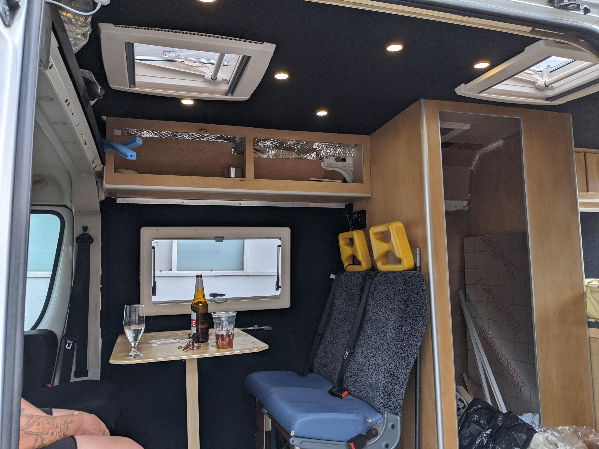

Making use of the front driver and passenger seats in the dining area was a _pivotal_ part of the layout. To make this happen seat base swivels would need to be fitted.
I went for the CTA seat swivels which cost about £125 a seat, they are designed for the Ducato/Boxer/Relay van and are a universal fit for either side.

Fitting was very simple:

- Remove 6 torx screws securing seat to seat base. It's easier to remove the bolts at the rear first, you need to slide the seat forwards for access.
- Unclip the occupancy detection wiring plug so it doesn't prevent moving the seat out of the way.
- Move seat out of the way.

- Bolt on seat base swivel with the same 6 torx screws, you need to rotate it about 30&deg; to get access to the bolt holes.
- Lift the seat onto the swivel, it's easier to start at the front as the seat probably wants to tip backwards and if you removed the front bolts last, the seat will be positioned at the back of the seat rails.
- Use allen bolts, washers and nuts to secure seat to swivel top.

It took me around 45 mins to do the first seat and once I'd worked out the best way to do it about 30 mins to do the driver's side.

This was a simple and satisfying job to do, the parts were reasonably priced and very good quality. Once I'd done a bit more decorative work around the dining area it was great to see the layout coming together. Time for a celebratory beer.

