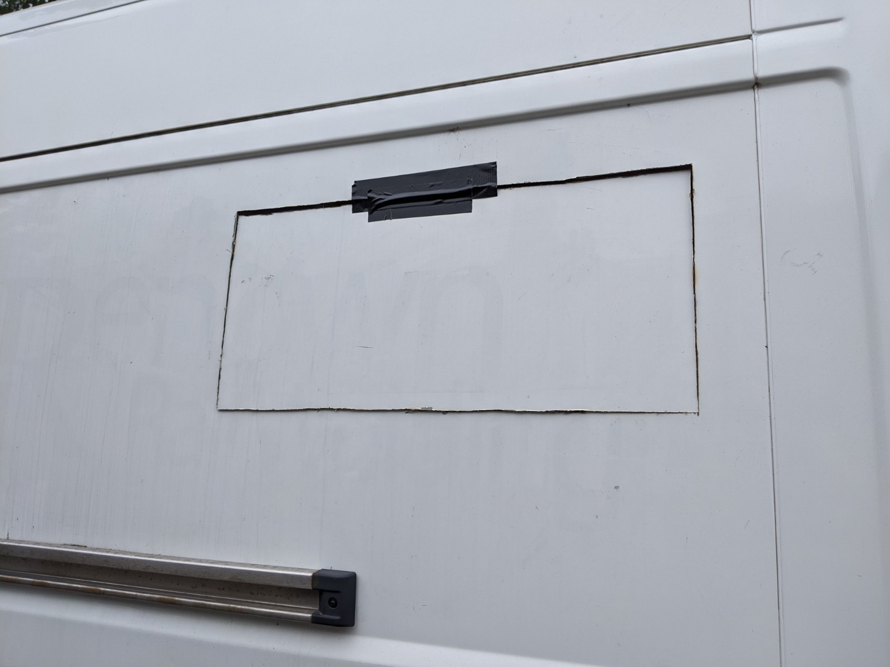
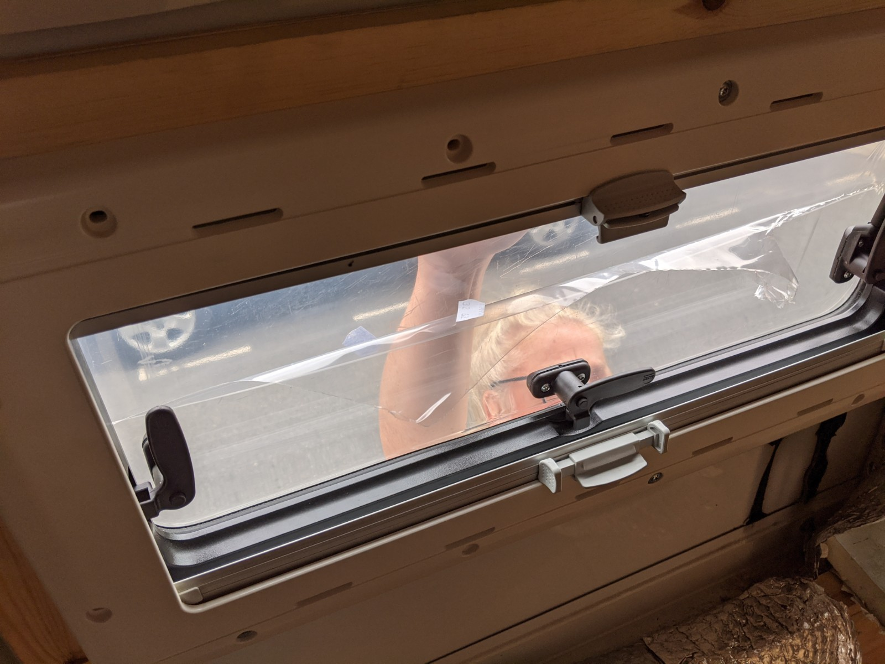
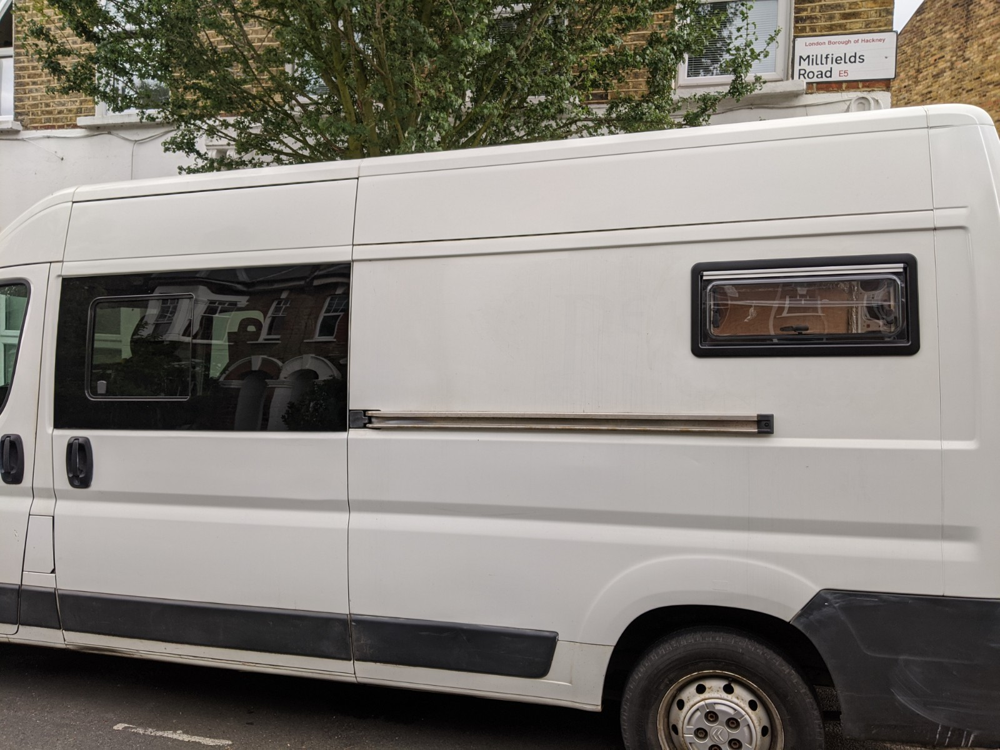

The [DVLA guidance for converting a van to a motorhome](https://www.gov.uk/government/publications/converting-a-vehicle-into-a-motor-caravan/converting-a-vehicle-into-a-motor-caravan) states:

_2 or more windows on at least one side of the main body (this does not include windows on the driver or passenger doors) to provide a reasonable amount of daylight into the living accommodation_

Which made the van deficient in the window department to the tune of one.

I opted for a 600mm x 350mm Seitz S4 window for the bedroom area, on the same side as the sliding door. Originally I'd attempted to get a 500mm x 350mm window but to no avail. This slightly larger window provided me with some mild anxiety in the form of:

_What if there's not enough room for the window to open wide and the sliding door to fully open at the same time?_

I knew the answer to that, the sliding door would win in a fight and an expensive lesson would be learned. I also knew that this was bound to happen no matter how hard I tried to avoid it, all it would take would be to park slightly uphill on a hot day.

Anyway after some rough measuring I decided to JFDI and get the window installed, it had sat in our bathroom for months where there's a similar likelihood damage due to misadventure.

I'd learned a lot from the previous cutting and fitting of windows and skylights. I'd already made a frame and had marked out the inside of the van wall.

1mm slitting disc fitted to the Von Haus angle grinder, goggles on, and it was time to get metal sparks in the face.

Some major roadworks around the house meant parking was limited and cutting the hole for the window had to be done from inside the van. After years of going to punk gigs I doubt my hearing is any the worse, and with our neighbours, not being able to hear is a bonus.

Again with the sanding flap disc, I sanded out the rough bits and took off the sharp edges.
Then it was time for a quick test fitting, just to check the frame and window and hole all play nicely together.
Finally I keyed the paint near around the hole with sandpaper and sealed any bare metal with Hammerite paint.

A bead of sealant was applied around the window inside the rubber seal and my glamourous assistant held the window in place while dodging oncoming traffic.

I tightened the inner frame to the outer window incrementally as you only get one chance when screwing into plastic and we were done.

The only question left unanswered was whether the sliding door could be opened while the window was open, thankfully there's a 20mm air gap so even if the door gets wanged open it won't take out the open window pane. Jammy.

We now conform to arbitrary DVLA window allocation guidelines!

