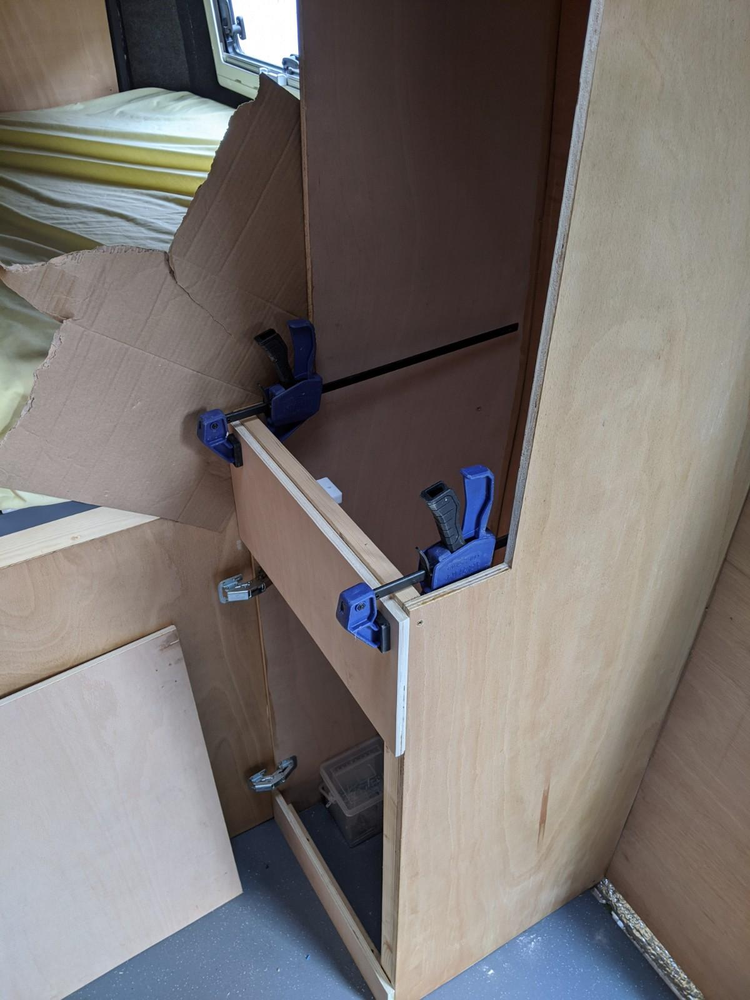
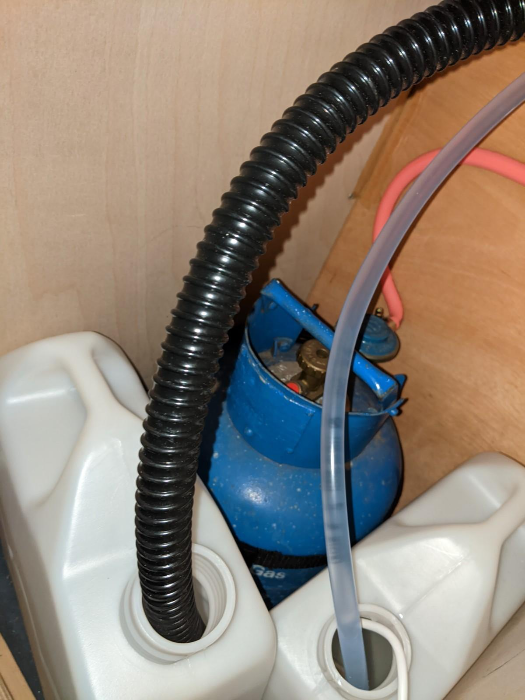
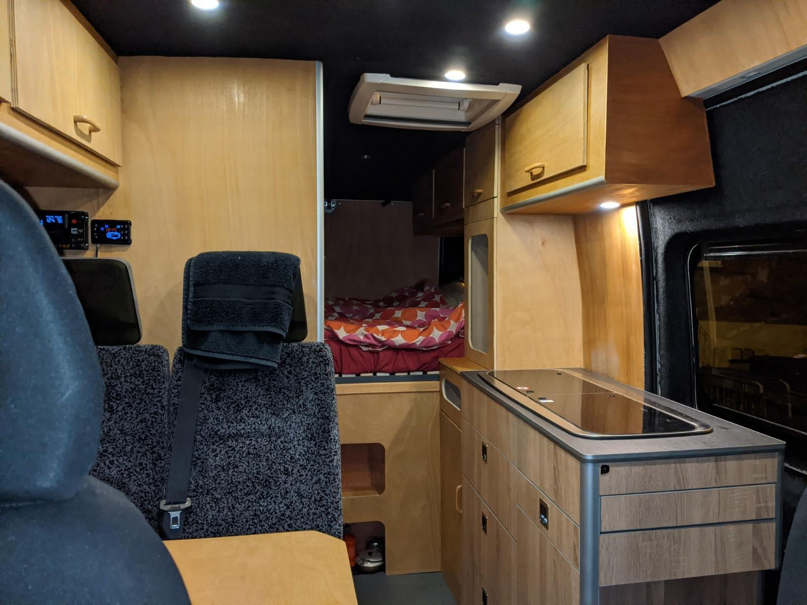

The layout I had in mind included an upright storage unit next to the kitchen. This would function as a wardrobe with gas bottle / water container storage below.
If I had the chance to do this again I'd take more time, but we were due to go on a family camping trip and I'd got as far as scribing the wardrobe walls into the side of the van so I decided to 'whack them in' with the idea that I would return to them and do it properly. This never happened, the kitchen arrived, numerous trips to the west country with my bike and some other jobs meant the kitchen was fitted before I'd really had the chance to check how straight everything was.

I decided to press on with fitting the front and doors without really thinking too much about how useful the space would be. I knew how wide the unit needed to be to accomodate a 4.5kg or 7kg gas bottle and some water containers. I deferred thinking about finishing details until they were utterly necessary.

Working with plywood inevitably leaves weird edges which don't look too bad sanded and varnished but are hard to get dead straight, sanded and varnished, at least with my woodworking skills.

The rushed nature of fitting this unit did leave a few critical measurements slightly off. Once the kitchen was in place I could see that there was a bit of a jaunty angle, not quite 90&deg; from the side of the van, the sides also had a bit of a lean meaning all the front measurements wandered out by 5mm or so. Meh, best to press on and accept the chaos.

I was also woefully short of larger pieces of ply to finish the unit and had a boot full of scraps that I was reluctant to burn as scrap. So I decided on a series of front panels and doors in the vague hope I could make it look pretty, it took a bit of back and forth to the saw bench before everything looked right. 
In any case the kitchen was the star of the show, so hopefully the eye wanders towards its beauty and away from old wobbly next door.

I've got a few finishing strips to glue to the visible edges of ply, and a tambour shutter door to make for the main cupboard. As ever, 'nearly done' is good enough for now.
I'm pleased with how the cupboard doors and handles mostly line up, the handles are from a cheap Wickes' multipack and are a good match to the varnished finish on the cupboard doors.

Not 100&percnt; sure how a tambour door will fit in a subtle paralellogram but that's a detail I'll come to in good time.
